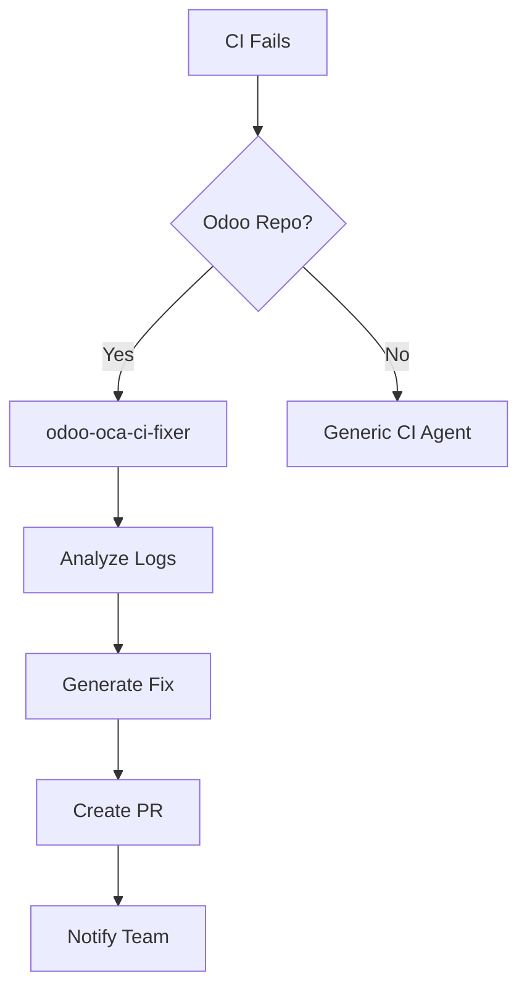
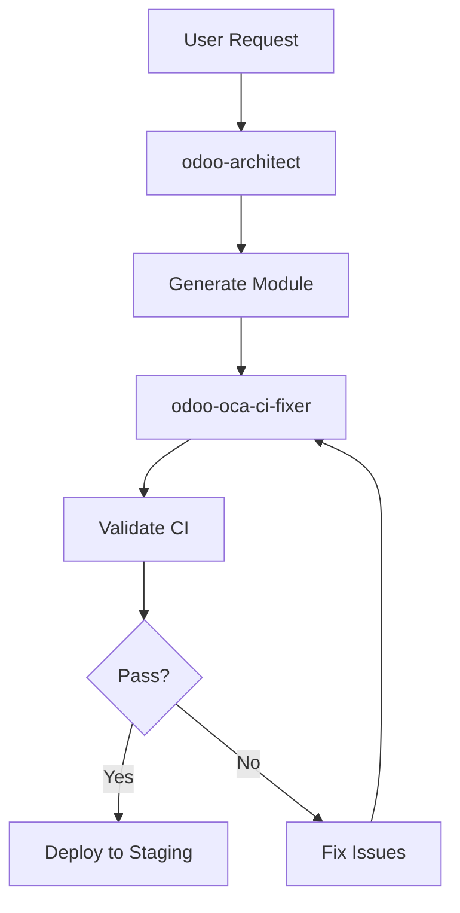

# InsightPulse Platform - Agent Orchestrator Configuration

This document defines the routing rules and orchestration logic for the InsightPulse multi-agent system.

## Agent Routing Table

| Pattern / Trigger | Complexity | Domain | Route / Agent | Notes |
|-------------------|-----------|---------|---------------|-------|
| "opex" AND ("policy" OR "process" OR "workflow") | simple | operations | opex-assistant | RAG-powered OpEx documentation |
| "data lab" OR "superset" OR "analytics" OR "jenny" | simple | analytics | data-lab-assistant | BI, dashboards, Deepnote |
| "odoo" AND ("module" OR "model" OR "view") | moderate | erp | odoo-architect | Odoo CE/OCA development |
| "odoo" AND ".github/workflows" AND ("CI failed" OR "workflow failure" OR "runbot") | moderate | devops | odoo-oca-ci-fixer | Auto-fix GitHub Actions for Odoo CE/OCA repos |
| "OCA" AND "GitHub Actions" | moderate | devops | odoo-oca-ci-fixer | Prefer OCA templates & maintainer-tools |
| "enterprise" AND "odoo" | moderate | devops | odoo-oca-ci-fixer | Detect and block Enterprise contamination |
| "figma" OR "design tokens" OR "design import" | moderate | design | design-import-agent | Design pipeline automation |
| "BPM" OR "business process" OR "training" | simple | business | bpm-suite | Business process management |
| "CTO" OR "platform strategy" OR "architecture" | complex | leadership | cto-mentor | Strategic guidance |

## Agent Priority Matrix

| Agent | Auto-Invoke | Manual Approval Required | Escalation Path |
|-------|-------------|--------------------------|-----------------|
| opex-assistant | ✓ | - | Manual review for policy changes |
| data-lab-assistant | ✓ | - | Escalate to CTO for platform changes |
| odoo-architect | - | ✓ | Escalate to senior dev for AGPL compliance |
| odoo-oca-ci-fixer | ✓ (CI failures) | ✓ (workflow changes) | Escalate on breaking changes |
| design-import-agent | ✓ | - | Escalate on design system conflicts |
| bpm-suite | ✓ | - | Manual review for org changes |
| cto-mentor | - | ✓ | N/A (top-level guidance) |

## Routing Logic

### 1. Intent Classification

The orchestrator uses the following hierarchy to classify incoming requests:

```
1. Keyword matching (patterns in routing table)
2. Context analysis (file paths, recent changes)
3. Event triggers (CI failures, PR events)
4. Fallback to general-purpose agent
```

### 2. Multi-Agent Orchestration

Some tasks require multiple agents working in sequence:

#### Odoo Module Development + CI
```
1. odoo-architect → Creates/modifies module
2. odoo-oca-ci-fixer → Validates CI workflow
3. Auto-merge if both pass
```

#### Design System Update
```
1. design-import-agent → Imports from Figma
2. Validate in staging
3. Deploy to production
```

### 3. Context Passing

When routing between agents, the orchestrator maintains context:

```yaml
context_schema:
  request_id: uuid
  original_query: string
  agent_chain: [agent_id, ...]
  artifacts:
    - type: file_change
      path: string
      content: string
    - type: ci_log
      source: github_actions
      content: string
  metadata:
    user_id: string
    timestamp: iso8601
    priority: high|medium|low
```

## Odoo CI Guardian - Detailed Routing

### Automatic Invocation Triggers

The `odoo-oca-ci-fixer` agent is automatically invoked when:

1. **CI Workflow Failure**
   ```yaml
   trigger:
     event: check_run.completed
     conclusion: failure
     repo_pattern: "(?i)(odoo|oca)"
     files_changed:
       - ".github/workflows/**"
       - "addons/**"
   ```

2. **Enterprise Contamination Detection**
   ```yaml
   trigger:
     event: push
     files_changed:
       - "**/__manifest__.py"
       - "**/models/*.py"
     content_patterns:
       - "from odoo.addons.enterprise"
       - "web_studio"
       - "documents"
   ```

3. **OCA Compliance Issues**
   ```yaml
   trigger:
     event: pull_request
     files_changed:
       - "**/__manifest__.py"
     validation_failures:
       - missing_license
       - wrong_structure
       - enterprise_dependency
   ```

### Manual Invocation

Use the CLI shim for manual invocation:

```bash
# From Odoo repository root
bin/oca-ci-fix.sh

# Or directly
cd ~/odoo-ce
../opex/bin/oca-ci-fix.sh .
```

### Context Provided to Agent

```json
{
  "repo_snapshot": {
    "tree": ["file1", "file2", ...],
    "workflows": [
      {
        "path": ".github/workflows/ci.yml",
        "content": "..."
      }
    ],
    "manifests": [
      {
        "path": "addons/ipai_expense/__manifest__.py",
        "content": "..."
      }
    ]
  },
  "ci_logs": "...",
  "target_branches": ["main", "18.0"],
  "recent_failures": [...]
}
```

### Expected Output

The agent returns:

```json
{
  "summary": "Fixed 3 issues in CI workflow",
  "issues": [
    {
      "type": "enterprise_contamination",
      "file": "addons/ipai_finance/models/report.py",
      "line": 42,
      "fix_applied": true
    }
  ],
  "patches": [
    {
      "file": ".github/workflows/ci-odoo-oca.yml",
      "action": "replace",
      "content": "..."
    }
  ],
  "next_steps": [
    "Review patches",
    "Run tests locally",
    "Commit and push"
  ]
}
```

## GitHub Integration

### Webhook Configuration

Set up GitHub webhooks to auto-route events:

```yaml
# .github/webhook-config.yml
webhooks:
  - url: https://orchestrator.insightpulseai.net/webhook/github
    events:
      - check_run
      - pull_request
      - push
    filters:
      repositories:
        - "odoo-ce"
        - "opex"
      paths:
        - ".github/workflows/**"
        - "addons/**"
        - "platform/odoo/**"
```

### Auto-Comment on PR

When the agent fixes issues, it comments on the PR:

```markdown
## 🤖 Odoo CE/OCA CI Guardian

I've detected and fixed the following issues:

### ❌ Enterprise Contamination
- **File:** `addons/ipai_finance/models/report.py:42`
- **Issue:** Import from `odoo.addons.enterprise.web_studio`
- **Fix:** Replaced with OCA alternative `report_xlsx`

### ✅ Workflow Updated
- **File:** `.github/workflows/ci-odoo-oca.yml`
- **Change:** Added Enterprise contamination check

### 📋 Next Steps
1. Review the changes in commit abc1234
2. Run tests locally: `./scripts/ci/run_odoo_tests.sh`
3. Merge if tests pass

---
*Generated by odoo-oca-ci-fixer v1.0.0*
```

## MCP Server Integration

The orchestrator uses these MCP servers:

```yaml
mcp_servers:
  - name: github-api
    url: https://api.github.com
    auth: token
    capabilities:
      - workflows
      - pull_requests
      - issues
      - comments

  - name: odoo-backend
    url: https://odoo-backend.insightpulseai.net
    capabilities:
      - module_validation
      - test_execution
      - manifest_check

  - name: supabase-tools
    url: https://ublqmilcjtpnflofprkr.supabase.co
    capabilities:
      - rag_query
      - analytics_fetch
      - logging
```

## Monitoring & Observability

### Agent Performance Metrics

Track key metrics for each agent:

```yaml
metrics:
  - name: invocation_count
    labels: [agent_id, success]
  - name: latency_seconds
    labels: [agent_id]
  - name: fixes_applied
    labels: [agent_id, fix_type]
  - name: escalations
    labels: [agent_id, reason]
```

### Alerting Rules

```yaml
alerts:
  - name: high_failure_rate
    condition: "success_rate < 0.8"
    severity: warning
    notify: ["#devops"]

  - name: agent_timeout
    condition: "latency > 300s"
    severity: critical
    notify: ["@oncall", "#incidents"]
```

## Example Flows

### Flow 1: CI Failure Auto-Fix



### Flow 2: New Odoo Module Development



## Configuration Files

- **Agent Registry:** `agents/registry/agents.yaml`
- **Routing Rules:** `agents/routing/odoo-ci-routing.yaml`
- **CLI Tools:** `bin/oca-ci-fix.sh`
- **Workflows:** `.github/workflows/ci-odoo-oca.yml`

## Security & Permissions

### Agent Permissions Matrix

| Agent | Read Files | Edit Files | Create PR | Deploy | Admin |
|-------|-----------|-----------|-----------|--------|-------|
| opex-assistant | ✓ | - | - | - | - |
| data-lab-assistant | ✓ | - | - | - | - |
| odoo-architect | ✓ | ✓ | ✓ | - | - |
| odoo-oca-ci-fixer | ✓ | ✓ | ✓ | - | - |
| design-import-agent | ✓ | ✓ | - | ✓ | - |
| cto-mentor | ✓ | - | - | - | - |

### Approval Requirements

| Operation | Auto-Approve | Manual Review | Approvers |
|-----------|-------------|---------------|-----------|
| Fix CI workflow | ✓ | - | - |
| Edit Odoo manifest | - | ✓ | @senior-dev |
| Deploy to production | - | ✓ | @devops, @cto |
| Change routing rules | - | ✓ | @platform-team |

## Troubleshooting

### Agent Not Invoked

1. Check routing rules match trigger patterns
2. Verify agent is `enabled: true` in registry
3. Review orchestrator logs
4. Test with CLI shim: `bin/oca-ci-fix.sh`

### Fix Not Applied

1. Check agent permissions
2. Review generated patches
3. Verify GitHub API access
4. Check for merge conflicts

### Wrong Agent Invoked

1. Review routing priority
2. Check keyword patterns
3. Adjust routing rules
4. Use explicit agent selection

---

**Version:** 1.0.0
**Last Updated:** 2025-11-23
**Maintainers:** InsightPulse Platform Team
