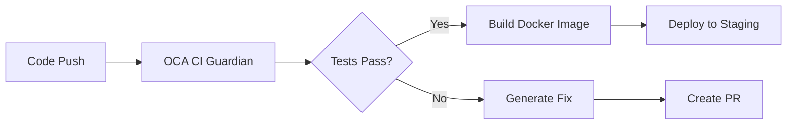

# Odoo CE/OCA CI Guardian

**Agent ID:** `odoo-oca-ci-fixer`
**Version:** 1.0.0
**Type:** CI/CD Automation & Quality Assurance

## Overview

The Odoo CE/OCA CI Guardian is an autonomous agent that audits, fixes, and maintains GitHub Actions workflows for Odoo 18 CE and OCA-style repositories. It enforces OCA maintainer conventions, prevents Enterprise contamination, and keeps CI pipelines green.

## Purpose

This agent ensures:
- ✅ All CI workflows comply with OCA best practices
- ✅ No dependencies on Odoo Enterprise modules or SaaS features
- ✅ Compatibility with OpenUpgrade and OCB
- ✅ Standardized repository layout following oca-addons-repo-template
- ✅ Reliable, repeatable builds with clear failure messages

## Key Features

### 1. Enterprise Contamination Detection
Automatically scans for and blocks:
- Odoo Enterprise module imports
- References to proprietary features (web_studio, documents, IAP)
- SaaS-only service dependencies

### 2. OCA Convention Enforcement
Ensures compliance with:
- OCA repository template structure
- OCA maintainer-tools integration
- Standard folder layout (addons/, setup/, .github/, tests/, scripts/)

### 3. OpenUpgrade Compatibility
Validates:
- Migration scripts compatibility
- OCB branch requirements
- Upgrade path integrity

### 4. Automated CI Fixes
Generates:
- Updated workflow YAML files
- Helper scripts for test execution
- Pre-commit configurations
- Detailed fix reports

## Usage

### Automatic Invocation

The agent is automatically invoked when:
1. CI pipeline fails in an Odoo repository
2. Pull request includes changes to `.github/workflows/`
3. New Odoo modules are added to `addons/` or `platform/odoo/addons/`

### Manual Invocation

```bash
# From repository root
claude-agent run odoo-oca-ci-fixer \
  --repo-snapshot="$(tree -L 3)" \
  --ci-logs="$(cat .github/workflows/ci.log)" \
  --target-branches="main,18.0"
```

### Agent Routing Rule

Add to `.claude/agent-routing.yaml`:

```yaml
routes:
  - name: odoo-ci-guardian
    trigger:
      path_patterns:
        - "addons/**/__manifest__.py"
        - ".github/workflows/**"
        - "platform/odoo/**"
      conditions:
        - file_exists: "addons/"
        - file_contains: "__manifest__.py"
    agent: odoo-oca-ci-fixer
    priority: high
```

## Workflow Integration

### Primary CI Workflow

The agent maintains `.github/workflows/ci-odoo-oca.yml` with three jobs:

1. **Lint & Static Checks**
   - Pre-commit hooks
   - Python linting (black, isort, pylint)
   - Enterprise contamination check

2. **Unit & Odoo Tests**
   - PostgreSQL service container
   - Odoo installation
   - Module test execution

3. **OpenUpgrade Smoke Test** (optional)
   - Migration script validation
   - OpenUpgradeLib compatibility check

### Helper Scripts

**`scripts/ci/run_odoo_tests.sh`**
- Configurable module testing
- Flexible logging levels
- Environment variable support

## Configuration

### Environment Variables

```bash
# Odoo version
ODOO_VERSION=18.0

# Python version
PYTHON_VERSION=3.10

# Database configuration
DB_NAME=odoo
PGHOST=localhost
PGPORT=5432
PGUSER=odoo
PGPASSWORD=odoo

# Test configuration
ODOO_MODULES=all
LOG_LEVEL=info
```

### Agent Parameters

```yaml
inputs:
  repo_snapshot: "tree output or file listing"
  ci_logs: "GitHub Actions logs or summary"
  target_branches: ["main", "18.0"]
```

## Core Checks

| Check | Description | Failure Action |
|-------|-------------|----------------|
| `workflow_layout` | Ensure CI workflow exists with proper matrix | Create/update workflow |
| `oca_conventions` | Enforce OCA repo template structure | Add missing files/dirs |
| `no_enterprise` | Detect Enterprise dependencies | Fail CI with clear error |
| `openupgrade_compat` | Validate migration scripts | Fix or warn |
| `ocb_compat` | Ensure OCB branch compatibility | Update requirements |

## Output

The agent produces:

### 1. Patch Set
- Updated `.github/workflows/*.yml`
- Modified or new `scripts/ci/*.sh`
- Updated `.pre-commit-config.yaml` (if needed)

### 2. Markdown Report
```markdown
## What was broken
- CI workflow missing pre-commit job
- Enterprise module reference in ipai_finance_ppm

## What I changed
- Added pre-commit job to ci-odoo-oca.yml
- Removed web_studio import from ipai_finance_ppm/models/report.py
- Added Enterprise contamination check

## How to extend
- Add custom OCA tools to lint job
- Configure module-specific test parameters
```

## Best Practices

### DO ✅
- Let the agent fix workflows automatically
- Review generated patches before merging
- Use OCA maintainer-tools when available
- Keep Enterprise and CE code in separate repos
- Follow OCA contribution guidelines

### DON'T ❌
- Manually override Enterprise contamination checks
- Mix Enterprise and CE modules in same repo
- Skip pre-commit hooks
- Ignore OpenUpgrade compatibility warnings
- Use proprietary Odoo features in CE addons

## Troubleshooting

### Issue: Enterprise Contamination Check Fails

**Cause:** Reference to Enterprise module detected

**Solution:**
```bash
# Find references
grep -R "enterprise\|web_studio\|documents\|iap" addons/

# Remove or isolate Enterprise code
# Move to separate repository or conditional import
```

### Issue: Tests Fail with Module Not Found

**Cause:** Missing dependencies in requirements.txt

**Solution:**
```bash
# Update requirements.txt
echo "odoo==18.0" >> requirements.txt
echo "openupgradelib" >> requirements.txt

# Let agent regenerate workflow
```

### Issue: OpenUpgrade Check Fails

**Cause:** Migration scripts incompatible with OpenUpgrade

**Solution:**
- Review OpenUpgrade migration guide
- Update scripts in `openupgrade_scripts/`
- Test with OpenUpgrade tools locally

## Examples

### Example 1: Fix Failing CI

**Input:**
```bash
# CI failing due to missing pre-commit config
Error: .pre-commit-config.yaml not found
```

**Agent Output:**
```yaml
# .pre-commit-config.yaml
repos:
  - repo: https://github.com/pre-commit/pre-commit-hooks
    rev: v4.4.0
    hooks:
      - id: trailing-whitespace
      - id: end-of-file-fixer
```

### Example 2: Remove Enterprise Dependency

**Input:**
```python
# addons/ipai_finance/models/report.py
from odoo.addons.web_studio.controllers import main
```

**Agent Output:**
```markdown
## Issues Found
- Enterprise module import: web_studio

## Fix Applied
- Removed web_studio import
- Added OCA alternative: report_xlsx
- Updated manifest dependencies
```

## Integration with Deployment Pipeline

This agent works alongside the Odoo deployment infrastructure:



## References

- [Odoo 18.0 Documentation](https://www.odoo.com/documentation/18.0/)
- [OCA Maintainer Tools](https://github.com/OCA/maintainer-tools)
- [OCA Repository Template](https://github.com/OCA/oca-addons-repo-template)
- [OpenUpgrade](https://github.com/OCA/OpenUpgrade)
- [OCB (Odoo Community Backports)](https://github.com/OCA/OCB)

## Contributing

To improve the agent:

1. Update `agents/odoo/odoo_oca_ci_fixer.yaml` with new checks
2. Extend `prompts/odoo_oca_ci_fixer_system.txt` with new rules
3. Add test cases to validate fixes
4. Update this documentation

## Changelog

### Version 1.0.0 (2025-11-23)
- Initial release
- Enterprise contamination detection
- OCA convention enforcement
- OpenUpgrade compatibility checks
- Automated workflow generation
- Integration with deployment pipeline

---

**Maintained by:** InsightPulse Platform Team
**Agent Type:** Autonomous CI/CD Guardian
**Status:** Production Ready
