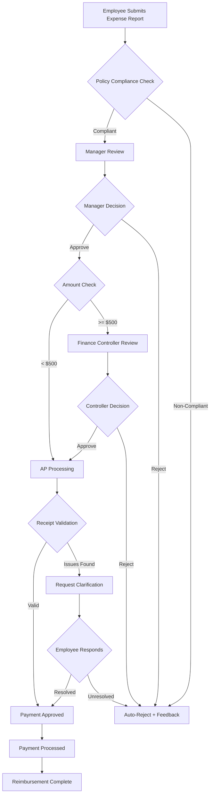

# Expense Reimbursement Workflow

## Overview

The expense reimbursement workflow enables employees to submit business expenses for reimbursement. This process ensures policy compliance, proper documentation, audit trail, and timely payment.

**Target Audience**: All Employees, Managers, Finance Team (AP), Auditors

**Process Duration**: 7-10 business days (from submission to payment)

---

## Workflow Diagram

*Figure 1: Expense reimbursement approval workflow*

---

## BPMN Process Model

### Swimlanes (Actors)

| Lane | Role | Responsibilities |
|------|------|------------------|
| **Employee** | Claimant | Submits expense report with receipts |
| **Manager** | First Approver | Validates business purpose and reasonableness |
| **AP Team** | Processor | Receipt validation, coding, payment |
| **Finance Controller** | Exception Approver | High-value or unusual expense approval |
| **Auditor** | Compliance | Random sampling and audit review |

### System Integration Points

- **ServiceNow**: Expense report submission and workflow routing
- **ERP System**: Payment processing and GL posting
- **Clarity PPM**: Budget tracking and reporting

---

## Process Steps

### Step 1: Expense Report Submission

**Actor**: Employee

**Inputs**:
- Expense date and description
- Category (meals, travel, supplies, etc.)
- Amount in local currency
- Payment method (personal card, cash advance)
- Digital receipts/invoices
- Business justification
- Client/project code (if applicable)

**Actions**:
1. Access expense report in ServiceNow
2. Enter expense line items
3. Upload receipts (required for >₱500 per item)
4. Categorize expenses per policy
5. Add business justification
6. Submit for manager approval

**Validation Rules** (Auto-enforced):
- Receipt required for single expenses >₱500
- Expense must be within 60 days of occurrence
- Per diem rates cannot exceed policy limits
- Alcohol expenses flagged for review
- International expenses require currency conversion

**Output**: Expense report → Status: "Pending Manager Approval"

**Estimated Time**: 20-30 minutes

---

### Step 2: Manager Approval

**Actor**: Direct Manager

**Decision Criteria**:
- Business necessity and legitimacy
- Compliance with expense policy
- Reasonableness of amounts
- Proper categorization
- Budget impact

**Actions**:
1. Review expense report and attached receipts
2. Verify business justification
3. Check for policy compliance
4. Validate expense categories
5. Make decision:
   - **Approve** → Forward to Finance
   - **Reject** → Return with explanation
   - **Request Revision** → Ask for clarification/corrections

**Common Rejection Reasons**:
- Missing receipts
- Personal expenses included
- Policy limit exceeded
- Insufficient justification
- Incorrect coding

**Output**: Approved/Rejected report

**SLA**: 3 business days

---

### Step 3: Finance Controller Review (if required)

**Actor**: Finance Controller

**Triggers**:
- Total claim amount ≥ ₱25,000
- Unusual or exceptional expenses
- Entertainment expenses > ₱10,000
- First-class travel or luxury accommodations
- Manager flagged for additional review

**Decision Criteria**:
- Policy exception justification
- Budget impact assessment
- Compliance with tax regulations
- Audit risk evaluation

**Actions**:
1. Review high-value or exceptional expenses
2. Validate supporting documentation
3. Assess policy exception merit
4. Make decision:
   - **Approve** → Forward to AP
   - **Reject** → Return with explanation
   - **Request Additional Documentation** → Send back

**Output**: Controller approval/rejection

**SLA**: 2 business days

---

### Step 4: AP Processing & Receipt Validation

**Actor**: Accounts Payable Team

**Validation Checks**:
- Receipt legibility and completeness
- Amounts match receipts
- VAT/tax coding correctness
- GL account assignment
- Duplicate claim detection
- Currency conversion accuracy

**Actions**:
1. Verify all receipts uploaded
2. Validate amounts against receipts
3. Check for duplicate submissions
4. Code to appropriate GL accounts
5. Apply correct tax treatment
6. Flag discrepancies for employee clarification
7. Approve for payment

**Common Issues**:
- Missing receipts
- Illegible receipts
- Amount discrepancies
- Wrong currency conversion
- Duplicate claims

**Output**: Payment approved or clarification requested

**SLA**: 3 business days

---

### Step 5: Payment Processing

**Actor**: AP Team

**Actions**:
1. Process approved reimbursements in ERP
2. Batch payments (twice weekly)
3. Post to employee payroll or direct deposit
4. Update expense report status
5. Send payment notification to employee

**Payment Schedule**:
- Submissions by Wednesday 5 PM → Friday payment
- Submissions by Monday 5 PM → Wednesday payment

**Output**: Reimbursement paid to employee

**SLA**: 2 business days after approval

---

## Approval Matrix

| Expense Type | Per Transaction Limit | Requires Manager | Requires Controller | Notes |
|--------------|----------------------|------------------|---------------------|-------|
| Meals (local) | ₱1,000 | ✓ | - | Per diem applies |
| Meals (client entertainment) | ₱5,000 | ✓ | >₱10K | Pre-approval recommended |
| Local transportation | ₱500 | ✓ | - | Receipt required >₱200 |
| Domestic flights | Economy only | ✓ | Premium class | Business justification needed |
| International flights | Economy only | ✓ | ✓ | Exception requires CFO |
| Accommodation | ₱5,000/night | ✓ | >₱8,000 | City-specific rates apply |
| Supplies & materials | ₱2,000 | ✓ | - | Consider purchase request |
| Conference fees | ₱20,000 | ✓ | >₱50K | Pre-approval required |
| Other expenses | ₱5,000 | ✓ | >₱25K | Clear justification needed |

---

## RACI Matrix

| Step | Employee | Manager | AP Team | Finance Controller | Systems |
|------|----------|---------|---------|-------------------|---------|
| Submit Report | **R/A** | I | I | I | **A** |
| Manager Review | I | **R/A** | I | I | **A** |
| Controller Review | I | C | I | **R/A** | **A** |
| Receipt Validation | C | I | **R/A** | I | **A** |
| Payment Processing | I | I | **R/A** | I | **A** |

**Legend**: R = Responsible | A = Accountable | C = Consulted | I = Informed

---

## Forms and Templates

1. **Expense Report Template** ([Download](/templates/finance/expense-report.xlsx))
2. **Mileage Log** ([Download](/templates/finance/mileage-log.xlsx))
3. **Entertainment Justification Form** ([Download](/templates/finance/entertainment-justification.docx))
4. **Receipt Missing Affidavit** ([Download](/templates/finance/receipt-affidavit.docx))

---

## Policy Highlights

### Eligible Expenses
✓ Business meals with clients/prospects
✓ Transportation to/from business meetings
✓ Conference and training fees
✓ Business supplies and materials
✓ Accommodation during business travel
✓ Communication expenses (roaming, internet)

### Ineligible Expenses
✗ Personal meals or entertainment
✗ Commuting to/from regular office
✗ Alcoholic beverages (without pre-approval)
✗ Personal items or clothing
✗ Traffic fines or parking violations
✗ Late fees or interest charges

---

## Common Scenarios

### Scenario 1: Lost Receipt

**Situation**: Employee lost receipt for business expense

**Solution**:
1. Submit "Missing Receipt Affidavit" (limit 3 per year)
2. Provide alternative proof (credit card statement, confirmation email)
3. Manager must provide additional justification
4. Finance controller approval required for >₱2,000

**Action**: Attach affidavit and supporting documents

---

### Scenario 2: International Travel

**Situation**: Multi-day international business trip

**Requirements**:
- Pre-trip approval recommended
- Daily expense diary
- Foreign currency receipts with conversion rate
- Immigration stamps or boarding passes
- Itinerary and meeting confirmations

**Action**: Submit comprehensive travel report with all documentation

---

### Scenario 3: Team Event Expenses

**Situation**: Manager paid for team building activity

**Requirements**:
- Pre-approval from Department Head required
- Attendee list with signatures
- Business justification (morale, recognition, etc.)
- Per-person cost breakdown
- Budget code allocation

**Action**: Attach pre-approval and attendee documentation

---

## Metrics and KPIs

| Metric | Target | Measurement |
|--------|--------|-------------|
| Average processing time | 7 business days | Submission → Payment |
| First-pass approval rate | >90% | No revisions needed |
| Policy compliance rate | >95% | Compliant submissions |
| Receipt completeness | >98% | All receipts provided |
| Employee satisfaction | >4.0/5.0 | Quarterly survey |

---

## Troubleshooting

### Expense Report Rejected
**Actions**:
1. Review rejection notes carefully
2. Correct identified issues
3. Add clarifying information
4. Resubmit within 10 days

### Payment Delayed
**Actions**:
1. Check expense report status in ServiceNow
2. Verify bank details on file
3. Contact AP team at ap@company.com
4. Escalate to manager if >15 days

### Receipt Quality Issues
**Actions**:
1. Retake photo in good lighting
2. Ensure all details visible
3. Save as PDF if possible
4. Upload multiple angles if needed

---

## Exception Handling

### Emergency Travel Expenses
**Protocol**:
1. Use corporate credit card if available
2. Submit expense report within 48 hours of return
3. Provide incident/emergency documentation
4. Mark as "Urgent" for expedited processing

**Contact**: ap@company.com with subject "URGENT REIMBURSEMENT"

### Policy Exception Request
**Protocol**:
1. Submit exception request before incurring expense
2. Obtain written approval from Finance Controller
3. Attach approval to expense report
4. Document business justification clearly

---

## Tax and Compliance Notes

**Philippines Tax Implications**:
- Reimbursements are generally not taxable to employee
- Proper documentation required for BIR compliance
- Entertainment expenses subject to 32% income tax
- Quarterly reporting to BIR required

**Audit Requirements**:
- All receipts retained for 7 years
- Random sampling conducted quarterly
- Non-compliance may result in reimbursement recovery
- Repeat violations may affect employment status

---

## Related Documentation

- [Expense Policy](/docs/finance/policies/expense-policy)
- [Travel and Entertainment Policy](/docs/finance/policies/travel-entertainment)
- [ServiceNow User Guide](/docs/finance/systems/servicenow)

---

## Policy References

- **Finance Policy Manual**: FIN-002 - Expense Reimbursement Policy
- **Travel Policy**: HR-008 - Business Travel Guidelines
- **Tax Compliance**: FIN-010 - Tax Treatment of Expenses

---

## Revision History

| Version | Date | Author | Changes |
|---------|------|--------|---------|
| 1.0 | 2025-01-15 | Finance Team | Initial documentation |

---

## Contact and Support

**Questions**: finance@company.com
**Accounts Payable**: ap@company.com
**Policy Clarifications**: Extension 5100
**Feedback**: [Submit via GitHub](https://github.com/jgtolentino/opex/issues/new)
