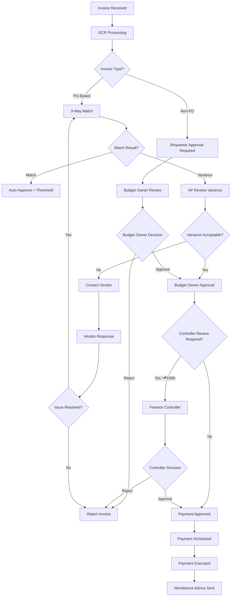

# Invoice Processing Workflow

## Overview

The invoice processing workflow manages the end-to-end lifecycle of vendor invoices from receipt to payment. This ensures accurate 3-way matching, budget compliance, vendor satisfaction, and audit trail integrity.

**Target Audience**: Accounts Payable Team, Budget Owners, Finance Controllers, Procurement Team, Auditors

**Process Duration**: 10-15 business days (standard payment terms: Net 30)

---

## Workflow Diagram

*Figure 1: Invoice processing and payment approval workflow*

---

## BPMN Process Model

### Swimlanes (Actors)

| Lane | Role | Responsibilities |
|------|------|------------------|
| **AP Clerk** | Processor | Invoice receipt, data entry, matching |
| **OCR System** | Automation | Automated invoice data extraction |
| **Budget Owner** | Approver | Validates expense legitimacy and budget |
| **Finance Controller** | High-Value Approver | Reviews large invoices (>₱100K) |
| **AP Manager** | Exception Handler | Resolves disputes and exceptions |
| **Vendor** | External Party | Provides invoices and resolves queries |

### System Integration Points

- **ERP System**: Invoice recording, GL posting, payment processing
- **OCR Tool**: Automated invoice data extraction
- **Clarity PPM**: Budget verification
- **ServiceNow**: Approval workflow routing
- **Email**: Invoice receipt and vendor communication

---

## Process Steps

### Step 1: Invoice Receipt & Registration

**Actor**: AP Clerk / OCR System

**Input Channels**:
- Email: ap@company.com
- Vendor portal upload
- Physical mail (scanned)
- EDI/API integration

**Actions**:
1. Receive invoice (digital or scan physical)
2. OCR extraction of invoice data:
   - Vendor name and TIN
   - Invoice number and date
   - Line items and amounts
   - Tax amounts (VAT, WHT)
   - Payment terms
3. Validate OCR accuracy (AP clerk review)
4. Register in ERP system
5. Assign unique tracking number

**Validation Checks**:
- Invoice not a duplicate
- Vendor is in approved vendor list
- Invoice format meets standards
- All required fields present

**Output**: Invoice registered → Status: "Pending Matching"

**Estimated Time**: 10-15 minutes (automated), 5 minutes (manual review)

---

### Step 2: Invoice Type Classification

**Actor**: ERP System (Automated)

**Classification Logic**:

| Invoice Type | Criteria | Routing |
|-------------|----------|---------|
| **PO-Based** | Invoice references valid PO number | 3-way match process |
| **Non-PO** | No PO reference or PO not required | Budget owner approval |
| **Recurring** | Monthly/periodic (utilities, rent) | Expedited approval |
| **Credit Memo** | Negative amount | AP manager review |

**Output**: Invoice classified and routed

---

### Step 3A: 3-Way Match (PO-Based Invoices)

**Actor**: ERP System (Automated) + AP Clerk

**Matching Components**:
1. **Purchase Order**: Authorized purchase agreement
2. **Goods Receipt**: Confirmation of delivery
3. **Invoice**: Vendor's payment request

**Match Criteria**:

| Element | Tolerance | Action if Exceeded |
|---------|-----------|-------------------|
| Price variance | ±2% or ₱1,000 | AP review required |
| Quantity variance | ±5% or 10 units | AP review required |
| Tax calculation | 0% (exact match) | AP correction |
| Delivery terms | Exact match | Procurement review |

**Automated Outcomes**:
- **Perfect Match (<₱10,000)**: Auto-approve, proceed to payment
- **Perfect Match (≥₱10,000)**: Route to budget owner confirmation
- **Variance Detected**: Route to AP analyst for investigation

**Output**: Match result (Pass/Fail with variance details)

**SLA**: Real-time (automated)

---

### Step 3B: Budget Owner Approval (Non-PO Invoices)

**Actor**: Budget Owner (Cost Center Manager)

**Review Requirements**:
- Service/goods actually received
- Invoice amount reasonable and expected
- Proper coding to budget account
- Compliance with company policies

**Actions**:
1. Review invoice and supporting documents
2. Verify services rendered or goods received
3. Confirm budget availability in Clarity PPM
4. Validate GL account coding
5. Make decision:
   - **Approve** → Forward to finance
   - **Reject** → Return to vendor
   - **Request Revision** → Request corrections

**Common Rejection Reasons**:
- Services not received
- Pricing error
- Unauthorized purchase
- Insufficient budget
- Missing supporting documents

**Output**: Approved/Rejected invoice

**SLA**: 5 business days

---

### Step 4: AP Review of Variances

**Actor**: AP Analyst

**Investigation Steps**:
1. Compare invoice to PO and goods receipt
2. Identify source of variance:
   - Pricing changes
   - Quantity discrepancies
   - Partial deliveries
   - Tax calculation errors
3. Contact vendor if necessary
4. Contact requester for clarification
5. Resolve or escalate to AP manager

**Acceptable Variances**:
- Pre-approved price increases
- Partial delivery (adjust payment)
- Freight/handling charges (if in PO)
- Corrected tax calculations

**Output**: Variance resolved or invoice rejected

**SLA**: 3 business days

---

### Step 5: Finance Controller Approval (High-Value)

**Actor**: Finance Controller

**Triggers**:
- Invoice amount ≥ ₱100,000
- New vendor (first 3 invoices)
- Unusual or exceptional charges
- Budget owner flagged for review

**Review Criteria**:
- Budget impact assessment
- Vendor contract compliance
- Payment terms reasonableness
- Cash flow implications
- Tax compliance

**Actions**:
1. Review invoice details and approvals
2. Validate against budget and forecast
3. Assess vendor relationship
4. Make decision:
   - **Approve** → Proceed to payment
   - **Reject** → Return with explanation
   - **Negotiate** → Request payment terms adjustment

**Output**: Controller approval/rejection

**SLA**: 2 business days

---

### Step 6: Payment Scheduling

**Actor**: AP Team

**Payment Schedule**:
- **Standard Terms (Net 30)**: Paid 28 days after invoice date
- **Early Payment Discount**: Paid within discount period if >2% discount
- **Urgent**: 5 business days (with approval)
- **Recurring**: Auto-scheduled based on agreement

**Actions**:
1. Calculate payment due date
2. Apply early payment discounts if applicable
3. Schedule in payment batch
4. Verify bank details
5. Prepare payment file

**Payment Batches**:
- **Check payments**: Wednesdays
- **Electronic transfers**: Tuesdays and Fridays
- **Urgent payments**: Same-day (before 2 PM cutoff)

**Output**: Payment scheduled

**SLA**: 1 business day before due date

---

### Step 7: Payment Execution

**Actor**: AP Manager / Treasury Team

**Actions**:
1. Review payment batch for accuracy
2. Verify total payment amount
3. Execute payment:
   - Bank transfer (preferred)
   - Check printing and mailing
   - Wire transfer (international)
4. Post payment in ERP
5. Update invoice status to "Paid"
6. Generate payment confirmation

**Output**: Payment executed

**SLA**: On scheduled payment date

---

### Step 8: Remittance Advice

**Actor**: AP System (Automated)

**Actions**:
1. Generate remittance advice with:
   - Payment date and amount
   - Invoices paid (numbers and amounts)
   - Payment method and reference
   - Deductions (if any)
2. Email to vendor contact
3. Archive for records

**Output**: Vendor notified of payment

---

## Approval Matrix

| Invoice Amount | AP Clerk | Budget Owner | Finance Controller | AP Manager |
|----------------|----------|--------------|-------------------|------------|
| Up to ₱10,000 (PO match) | ✓ | - | - | - |
| ₱10,001 - ₱50,000 | ✓ | ✓ | - | - |
| ₱50,001 - ₱100,000 | ✓ | ✓ | - | Exception only |
| Over ₱100,000 | ✓ | ✓ | ✓ | Exception only |
| Non-PO (any amount) | ✓ | ✓ | >₱100K | Exception only |

---

## RACI Matrix

| Step | AP Clerk | Budget Owner | Finance Controller | AP Manager | Systems |
|------|----------|--------------|-------------------|------------|---------|
| Invoice Receipt | **R** | I | I | I | **A** |
| OCR Processing | C | I | I | I | **R/A** |
| 3-Way Match | **R** | I | I | I | **A** |
| Budget Approval | I | **R/A** | I | C | **A** |
| Variance Resolution | **R** | C | I | **A** | **A** |
| Controller Review | I | C | **R/A** | I | **A** |
| Payment Scheduling | **R** | I | I | **A** | **A** |
| Payment Execution | **R** | I | I | **A** | **A** |

**Legend**: R = Responsible | A = Accountable | C = Consulted | I = Informed

---

## Forms and Templates

1. **Non-PO Invoice Approval Form** ([Download](/templates/finance/non-po-approval.xlsx))
2. **Invoice Variance Resolution Form** ([Download](/templates/finance/variance-resolution.docx))
3. **Vendor Payment Terms Request** ([Download](/templates/finance/payment-terms-request.docx))

---

## Common Scenarios

### Scenario 1: Missing Purchase Order

**Situation**: Invoice received without PO reference

**Solution**:
1. Contact vendor for PO number
2. If no PO exists → Route to budget owner for approval
3. Verify services/goods actually received
4. Process as non-PO invoice

**Prevention**: Educate vendors on PO requirements

---

### Scenario 2: Partial Delivery

**Situation**: Invoice for full amount, only partial delivery received

**Solution**:
1. Contact vendor to issue revised invoice
2. Or pay partial amount and hold balance
3. Update PO to reflect partial receipt
4. Document outstanding balance

**Action**: AP analyst coordinates with vendor and requester

---

### Scenario 3: Early Payment Discount

**Situation**: Vendor offers 2% discount for payment within 10 days

**Solution**:
1. Evaluate discount vs. cash flow
2. If >2% discount → expedite approval
3. Prioritize in payment schedule
4. Process within discount period

**Action**: AP team fast-tracks approval chain

---

## Metrics and KPIs

| Metric | Target | Measurement |
|--------|--------|-------------|
| Average processing time | 10 business days | Receipt → Payment |
| On-time payment rate | >95% | Paid by due date |
| 3-way match rate | >90% | PO invoices with clean match |
| Duplicate invoice rate | <1% | Duplicates detected/prevented |
| Early payment discount capture | >80% | Discounts taken / offered |
| Invoice accuracy rate | >98% | First-pass processing |

---

## Troubleshooting

### Invoice Stuck in Approval
**Actions**:
1. Check current workflow status in ERP
2. Contact assigned approver
3. Escalate to AP manager after 7 days
4. Notify vendor of delay

### Vendor Disputes Payment
**Actions**:
1. Provide remittance advice and proof of payment
2. Verify bank details on file
3. Trace payment through banking system
4. Issue duplicate payment if original lost (with indemnity)

### Tax Calculation Errors
**Actions**:
1. Verify vendor TIN and tax status
2. Recalculate VAT and withholding tax
3. Request corrected invoice from vendor
4. Document correction for audit trail

---

## Exception Handling

### Urgent Payment Request
**Protocol**:
1. Requires AP Manager approval
2. Justification documented
3. All standard approvals compressed to 48 hours
4. Same-day payment if approved before 2 PM
5. Post-payment audit review

**Contact**: AP Manager or finance@company.com (Subject: URGENT PAYMENT)

### Disputed Invoice
**Protocol**:
1. Place invoice on hold
2. Document dispute details
3. Communicate with vendor within 2 business days
4. Attempt resolution within 10 business days
5. Escalate to Procurement or Legal if unresolved

---

## Tax and Compliance Notes

**Philippines BIR Compliance**:
- Withholding tax computed per BIR rules
- EWT certificates issued monthly to vendors
- Quarterly BIR reporting required (Form 1601-EQ)
- Invoices must be BIR-registered receipts
- 7-year retention requirement

**Audit Trail Requirements**:
- All invoices scanned and archived
- Approval chain documented
- Payment proof retained
- Variance resolutions documented

---

## Related Documentation

- [Purchase Request Workflow](/docs/finance/workflows/purchase-request)
- [Procurement Policy](/docs/finance/policies/procurement-policy)
- [ERP System Guide](/docs/finance/systems/erp-integration)

---

## Policy References

- **Finance Policy Manual**: FIN-004 - Invoice Processing and Payment
- **Procurement Policy**: PROC-002 - 3-Way Match Requirements
- **Tax Compliance**: FIN-011 - Withholding Tax Guidelines

---

## Revision History

| Version | Date | Author | Changes |
|---------|------|--------|---------|
| 1.0 | 2025-01-15 | Finance Team | Initial documentation |

---

## Contact and Support

**Questions**: ap@company.com
**Vendor Inquiries**: vendor-support@company.com
**System Issues**: Extension 5100
**Feedback**: [Submit via GitHub](https://github.com/jgtolentino/opex/issues/new)
