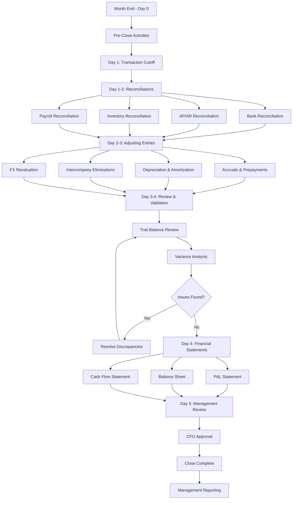

# Month-End Close Workflow

## Overview

The month-end close workflow is the systematic process of reviewing, reconciling, and finalizing financial transactions for the reporting period. This ensures accurate financial statements, regulatory compliance, and timely management reporting.

**Target Audience**: Accounting Team, Finance Controllers, CFO, Executive Leadership, External Auditors

**Process Duration**: 5 business days (close deadline: 5th business day of following month)

---

## Workflow Diagram



*Figure 1: Month-end close process timeline*

---

## BPMN Process Model

### Swimlanes (Actors)

| Lane | Role | Responsibilities |
|------|------|------------------|
| **Staff Accountant** | Executors | Reconciliations, journal entries, data validation |
| **Senior Accountant** | Reviewers | Review reconciliations, prepare adjustments |
| **Accounting Manager** | Coordinator | Oversee close process, resolve issues |
| **Finance Controller** | Approver | Approve financial statements, variance analysis |
| **CFO** | Final Signoff | Executive review and approval |

### System Integration Points

- **ERP System**: General ledger, subledgers, reporting
- **Clarity PPM**: Project accounting and budget data
- **Consolidation System**: Multi-entity consolidation
- **BI Tool**: Management dashboards and KPI tracking

---

## Pre-Close Activities (Day -2 to Day 0)

### Preparation Checklist

**Actor**: Accounting Manager

**Actions**:
1. Send close calendar reminder to all stakeholders
2. Verify all PO receipts processed
3. Ensure payroll approved and posted
4. Confirm AP cutoff with vendors
5. Request department accrual submissions
6. Verify FX rates published
7. Prepare reconciliation templates

**Output**: Team ready for close process

---

## Day 1: Transaction Cutoff & Preliminary Activities

### Step 1.1: Transaction Cutoff

**Actor**: Accounting Manager

**Actions**:
1. Lock prior period (11:59 PM last day of month)
2. Run preliminary trial balance
3. Verify all cash receipts deposited
4. Confirm last invoice date processed
5. Generate aging reports (AP/AR)
6. Export subledger data

**Cutoff Rules**:
- **Revenue Recognition**: Per delivery/acceptance
- **Expense Recognition**: Per invoice date
- **Cash Transactions**: Per bank value date
- **Payroll**: Per pay period end

**Output**: Clean transaction cutoff

**SLA**: Complete by 12 PM, Day 1

---

### Step 1.2: Initial Reconciliations

**Actor**: Staff Accountants (Parallel Tasks)

**Accounts to Reconcile**:

| Account Category | Owner | Priority |
|-----------------|-------|----------|
| Cash & Bank Accounts | Staff Accountant A | Critical |
| Accounts Receivable | Staff Accountant B | Critical |
| Accounts Payable | Staff Accountant C | Critical |
| Inventory | Staff Accountant D | High |
| Payroll Liabilities | Staff Accountant E | High |
| Fixed Assets | Senior Accountant | Medium |
| Prepayments & Accruals | Senior Accountant | High |

**Output**: Initial reconciliation results

**SLA**: Complete by 5 PM, Day 1

---

## Day 2: Detailed Reconciliations

### Step 2.1: Bank Reconciliation

**Actor**: Staff Accountant

**Actions**:
1. Download bank statements
2. Import transactions to ERP
3. Match cleared items
4. Identify outstanding items:
   - Deposits in transit
   - Outstanding checks
   - Bank fees/charges
   - Interest earned
5. Prepare reconciliation report
6. Investigate variances >₱1,000
7. Submit for senior accountant review

**Reconciliation Format**:
```
Bank Balance per Statement         ₱ XXX,XXX
Add: Deposits in transit            ₱ XXX,XXX
Less: Outstanding checks           (₱ XXX,XXX)
Add/Less: Bank errors               ₱ XXX
Adjusted Bank Balance               ₱ XXX,XXX

GL Balance per Books                ₱ XXX,XXX
Add: Interest earned                ₱ XXX
Less: Bank charges                 (₱ XXX)
Adjusted Book Balance               ₱ XXX,XXX

Difference (must be zero)           ₱ 0
```

**Output**: Completed bank reconciliation

**SLA**: Complete by 12 PM, Day 2

---

### Step 2.2: AR/AP Reconciliation

**Actor**: Staff Accountants

**AR Reconciliation**:
1. Run aged AR report
2. Reconcile to customer subledger
3. Identify overdue accounts
4. Review credit balances (potential returns)
5. Assess bad debt provision adequacy
6. Prepare collection forecast

**AP Reconciliation**:
1. Run aged AP report
2. Reconcile to vendor subledger
3. Identify unmatched invoices
4. Verify accruals for goods received not invoiced (GRNI)
5. Review debit balances (advance payments)
6. Prepare payment forecast

**Output**: AR/AP reconciliation with aging analysis

**SLA**: Complete by 5 PM, Day 2

---

### Step 2.3: Inventory Reconciliation

**Actor**: Staff Accountant + Warehouse

**Actions**:
1. Obtain physical count results (if month-end count)
2. Compare physical count to system
3. Investigate variances >5% or >₱10,000
4. Adjust for count variances
5. Review slow-moving inventory
6. Calculate inventory obsolescence provision
7. Reconcile to GL control account

**Output**: Inventory reconciliation and adjustments

**SLA**: Complete by 5 PM, Day 2

---

## Day 3: Adjusting Entries

### Step 3.1: Standard Accruals

**Actor**: Senior Accountants

**Common Accruals**:

| Accrual Type | Calculation Method | Frequency |
|--------------|-------------------|-----------|
| Utilities | Prior month × 1.05 | Monthly |
| Rent | Per lease agreement | Monthly |
| Professional fees | Per contract/invoice | As incurred |
| Interest expense | Loan balance × rate / 12 | Monthly |
| Salaries (unpaid days) | Daily rate × unpaid days | Month-end |
| Vacation/sick leave | Per HR accrual report | Monthly |

**Journal Entry Format**:
```
DR Expense Account              ₱ XXX,XXX
   CR Accrued Liabilities                  ₱ XXX,XXX
To record accrued [expense description]
```

**Output**: Accrual journal entries posted

**SLA**: Complete by 12 PM, Day 3

---

### Step 3.2: Depreciation & Amortization

**Actor**: Senior Accountant

**Actions**:
1. Run depreciation calculation in fixed asset module
2. Review new asset additions
3. Verify disposal/retirement entries
4. Calculate amortization for intangibles
5. Post depreciation journal entry
6. Update fixed asset register

**Validation**:
- Depreciation rate matches asset policy
- Fully depreciated assets not depreciating
- Disposed assets removed from register

**Output**: Depreciation entries posted

**SLA**: Complete by 2 PM, Day 3

---

### Step 3.3: Foreign Exchange Revaluation

**Actor**: Senior Accountant

**Actions**:
1. Obtain month-end FX rates (BSP or Reuters)
2. Identify foreign currency accounts:
   - Cash in foreign currency
   - AR/AP in foreign currency
   - Intercompany balances
3. Calculate revaluation gain/loss
4. Post FX revaluation entry

**Calculation**:
```
Balance (FC) × (Month-End Rate - Prior Rate) = FX Gain/(Loss)
```

**Output**: FX revaluation entries posted

**SLA**: Complete by 3 PM, Day 3

---

### Step 3.4: Intercompany Eliminations (if applicable)

**Actor**: Senior Accountant

**Actions**:
1. Reconcile intercompany AR/AP balances
2. Identify elimination entries needed
3. Resolve intercompany differences
4. Post elimination entries in consolidation system

**Output**: Intercompany reconciliation and eliminations

**SLA**: Complete by 5 PM, Day 3

---

## Day 4: Review & Financial Statement Preparation

### Step 4.1: Trial Balance Review

**Actor**: Accounting Manager

**Review Checklist**:
- ✓ All subledgers reconciled to GL
- ✓ All journal entries posted and approved
- ✓ No suspense accounts with balances
- ✓ AR/AP aging reasonable
- ✓ Inventory balance matches physical count
- ✓ Prepayments/accruals reviewed
- ✓ Bank reconciliations complete
- ✓ Tax accounts reconciled

**Output**: Clean trial balance

**SLA**: Complete by 12 PM, Day 4

---

### Step 4.2: Variance Analysis

**Actor**: Finance Controller

**Analysis Focus**:

| Item | Compare To | Variance Threshold |
|------|-----------|-------------------|
| Revenue | Budget & Prior Month | ±10% or ₱500K |
| COGS | Budget & Prior Month | ±10% or ₱300K |
| OpEx | Budget & Prior Month | ±15% or ₱200K |
| Net Income | Budget & Prior Month | ±20% or ₱1M |

**Actions**:
1. Calculate variances (actual vs. budget, actual vs. prior month)
2. Investigate significant variances
3. Prepare variance commentary
4. Identify trends and anomalies

**Output**: Variance analysis report

**SLA**: Complete by 3 PM, Day 4

---

### Step 4.3: Financial Statement Generation

**Actor**: Senior Accountant + Accounting Manager

**Financial Statements Prepared**:

1. **Income Statement (P&L)**
   - Revenue by product/service line
   - Cost of goods sold
   - Operating expenses by department
   - EBITDA calculation
   - Net income

2. **Balance Sheet**
   - Assets (current & non-current)
   - Liabilities (current & long-term)
   - Equity

3. **Cash Flow Statement**
   - Operating activities
   - Investing activities
   - Financing activities
   - Net change in cash

4. **Supporting Schedules**
   - Aging reports (AR/AP)
   - Revenue by customer/product
   - Expense by department
   - Key metrics and KPIs

**Output**: Draft financial statements

**SLA**: Complete by 5 PM, Day 4

---

## Day 5: Final Review & Approval

### Step 5.1: Finance Controller Review

**Actor**: Finance Controller

**Review Focus**:
- Financial statement accuracy
- Variance explanations completeness
- Compliance with accounting standards
- Reasonableness of balances
- Disclosure completeness
- Prior period comparatives

**Actions**:
1. Review financial statements in detail
2. Validate variance explanations
3. Check calculations and footings
4. Assess reasonableness
5. Approve or request corrections

**Output**: Controller-approved statements

**SLA**: Complete by 12 PM, Day 5

---

### Step 5.2: CFO Review & Approval

**Actor**: CFO

**Review Focus**:
- Strategic insights from results
- Performance vs. targets
- Cash flow adequacy
- Key business drivers
- Risk indicators

**Actions**:
1. Review financial performance
2. Assess business health
3. Prepare executive summary
4. Approve financial statements
5. Sign off on close completion

**Output**: CFO-approved financial statements

**SLA**: Complete by 3 PM, Day 5

---

### Step 5.3: Period Lock & Distribution

**Actor**: Accounting Manager

**Actions**:
1. Lock accounting period in ERP
2. Archive final financial statements
3. Distribute to authorized stakeholders:
   - Executive team
   - Board of directors
   - External auditors (if required)
   - Department heads (summary version)
4. Publish dashboards in BI tool
5. Schedule management review meeting

**Output**: Month-end close complete

**SLA**: Complete by 5 PM, Day 5

---

## RACI Matrix

| Step | Staff Accountant | Senior Accountant | Accounting Manager | Finance Controller | CFO |
|------|-----------------|-------------------|-------------------|-------------------|-----|
| Pre-Close Planning | C | C | **R/A** | C | I |
| Reconciliations | **R** | **A** | C | I | I |
| Adjusting Entries | C | **R** | **A** | C | I |
| Trial Balance Review | C | C | **R/A** | C | I |
| Variance Analysis | C | C | C | **R/A** | C |
| Financial Statements | C | **R** | **A** | C | I |
| Controller Review | I | C | C | **R/A** | I |
| CFO Approval | I | I | I | C | **R/A** |
| Period Lock | C | C | **R/A** | I | I |

**Legend**: R = Responsible | A = Accountable | C = Consulted | I = Informed

---

## Close Calendar (Template)

| Day | Deadline | Activity | Owner | Status |
|-----|----------|----------|-------|--------|
| Day -2 | 5 PM | Send close reminder | Acct Mgr | ⬜ |
| Day -1 | 5 PM | Verify payroll posted | Acct Mgr | ⬜ |
| Day 0 | 11:59 PM | Transaction cutoff | System | ⬜ |
| Day 1 | 12 PM | Preliminary TB | Staff | ⬜ |
| Day 1 | 5 PM | Initial reconciliations | Staff | ⬜ |
| Day 2 | 12 PM | Bank reconciliation | Staff A | ⬜ |
| Day 2 | 5 PM | AR/AP reconciliation | Staff B/C | ⬜ |
| Day 2 | 5 PM | Inventory reconciliation | Staff D | ⬜ |
| Day 3 | 12 PM | Accrual entries | Senior | ⬜ |
| Day 3 | 2 PM | Depreciation entries | Senior | ⬜ |
| Day 3 | 5 PM | All adjustments posted | Senior | ⬜ |
| Day 4 | 12 PM | Final TB review | Acct Mgr | ⬜ |
| Day 4 | 3 PM | Variance analysis | Controller | ⬜ |
| Day 4 | 5 PM | Financial statements | Acct Mgr | ⬜ |
| Day 5 | 12 PM | Controller review | Controller | ⬜ |
| Day 5 | 3 PM | CFO approval | CFO | ⬜ |
| Day 5 | 5 PM | Close complete | Acct Mgr | ⬜ |

---

## Metrics and KPIs

| Metric | Target | Measurement |
|--------|--------|-------------|
| Close completion | Day 5 | Actual close day |
| Number of adjustments | <20 | Post-close entries needed |
| Reconciliation variance | <₱10,000 | Total unreconciled differences |
| Variance explanations | 100% | Variances >threshold explained |
| Financial statement accuracy | 100% | No material errors |

---

## Common Issues & Resolutions

### Issue: Missing Accruals
**Resolution**:
1. Review prior month accruals
2. Contact department heads
3. Estimate based on historical data
4. Document assumption

### Issue: Bank Reconciliation Not Balancing
**Resolution**:
1. Re-check outstanding items
2. Verify bank statement completeness
3. Check for duplicate entries
4. Review prior month reconciliation

### Issue: Inventory Variance
**Resolution**:
1. Verify physical count accuracy
2. Check for unrecorded receipts/issues
3. Investigate pricing differences
4. Adjust with proper approval

---

## Related Documentation

- [Financial Policies](/docs/finance/policies/overview)
- [Chart of Accounts](/docs/finance/reference/chart-of-accounts)
- [ERP System Guide](/docs/finance/systems/erp-integration)

---

## Revision History

| Version | Date | Author | Changes |
|---------|------|--------|---------|
| 1.0 | 2025-01-15 | Finance Team | Initial documentation |

---

## Contact and Support

**Questions**: finance@company.com
**Accounting Manager**: accounting@company.com
**System Issues**: Extension 5100
