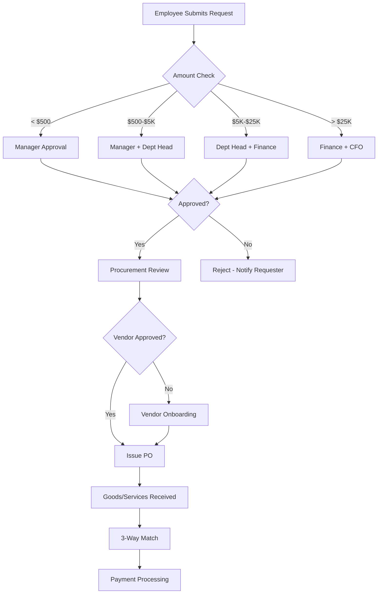

# Purchase Request Workflow

## Overview

The purchase request workflow is a structured process for requesting, approving, and procuring goods and services. This ensures proper budget control, vendor compliance, and audit trail for all organizational purchases.

**Target Audience**: All Employees, Managers, Procurement Team, Finance Controllers, Executive Leadership

**Process Duration**: 5-7 business days (standard), 2-3 days (urgent)

---

## Workflow Diagram

*Figure 1: Purchase request approval workflow*

---

## BPMN Process Model

### Swimlanes (Actors)

| Lane | Role | Responsibilities |
|------|------|------------------|
| **Requester** | Initiator | Submits request, provides business justification |
| **Manager** | First Approver | Reviews business need and budget alignment |
| **Department Head** | Second Approver | Validates strategic priority (>$5K) |
| **Finance Controller** | Budget Validation | Confirms budget availability (>$5K) |
| **Procurement Team** | Execution | Vendor verification, PO issuance |
| **CFO** | Executive Approval | Strategic review (>$25K) |

### System Integration Points

- **ServiceNow**: Purchase request submission and routing
- **Clarity PPM**: Budget verification and tracking
- **ERP System**: PO generation, vendor management, payment processing

---

## Process Steps

### Step 1: Purchase Request Initiation

**Actor**: Requester (Any Employee)

**Inputs**:
- Item/service description
- Quantity and unit price
- Business justification
- Budget code
- Preferred vendor (if known)
- Delivery deadline
- Attachments (quotes, specifications)

**Actions**:
1. Access purchase request form in ServiceNow
2. Complete required fields
3. Attach vendor quotes (minimum 3 quotes for >$10K)
4. Select budget code from Clarity PPM
5. Submit for approval

**Output**: Draft request → Status: "Pending Approval"

**Estimated Time**: 15-30 minutes

---

### Step 2: Manager Approval

**Actor**: Direct Manager

**Decision Criteria**:
- Business necessity
- Budget availability within team allocation
- Compliance with procurement policy
- Availability of alternatives

**Actions**:
1. Review request details and justification
2. Verify budget code ownership
3. Check for duplicate/similar purchases
4. Make decision:
   - **Approve** → Forward to next level (if required) or procurement
   - **Reject** → Return with feedback
   - **Request Revision** → Send back for modifications

**Approval Thresholds**:
- Up to $5,000: Manager approval sufficient
- Above $5,000: Requires department head

**Output**: Approved/Rejected request

**SLA**: 2 business days

---

### Step 3: Department Head Approval (if required)

**Actor**: Department Head

**Triggers**: Purchase amount >$5,000

**Decision Criteria**:
- Strategic alignment with department goals
- Priority vs. other spending
- ROI justification
- Impact on department budget

**Actions**:
1. Review request and manager approval notes
2. Validate against department spending plan
3. Assess strategic value
4. Make decision:
   - **Approve** → Forward to finance (if >$5K)
   - **Reject** → Return with feedback
   - **Request Revision** → Send back for additional justification

**Output**: Approved/Rejected request

**SLA**: 2 business days

---

### Step 4: Finance Controller Validation (if required)

**Actor**: Finance Team

**Triggers**: Purchase amount >$5,000

**Validation via Clarity PPM**:
- Budget code validity
- Remaining budget sufficiency
- Spending freeze status
- Compliance with budget policies

**Decision Logic**:

| Condition | Result |
|-----------|--------|
| Budget confirmed + No freeze | **Approve** → Move to CFO (if >$25K) or procurement |
| Insufficient budget | **Reject** → Notify requester and manager |
| Spending freeze active | **Hold** → Place on waiting list |
| Over $25K | **Escalate** → CFO approval required |

**Output**: Financial approval/rejection

**SLA**: 1-2 business days

---

### Step 5: CFO Approval (if required)

**Actor**: CFO

**Triggers**: Purchase amount >$25,000

**Decision Criteria**:
- Strategic alignment with company goals
- Cash flow impact
- Contract terms and commitments
- Vendor risk assessment

**Actions**:
1. Review executive summary
2. Assess financial impact
3. Review vendor terms
4. Make decision:
   - **Approve** → Forward to procurement
   - **Reject** → Request cancellation
   - **Negotiate** → Request better terms

**Output**: Final approval decision

**SLA**: 3 business days

---

### Step 6: Procurement Review & Vendor Validation

**Actor**: Procurement Team

**Validation Checks**:
- Vendor approved status
- Vendor insurance and certifications
- Contract compliance
- Pricing competitiveness
- Delivery terms

**Actions**:
1. Verify vendor in approved vendor list
2. If new vendor → Initiate vendor onboarding
3. Validate pricing against market rates
4. Review delivery terms
5. Negotiate improvements if needed
6. Generate purchase order

**Output**: Approved PO issued to vendor

**SLA**: 2 business days

---

### Step 7: Goods Receipt & 3-Way Match

**Actor**: Requester + Accounts Payable

**Actions**:
1. Requester receives goods/services
2. Requester confirms receipt in system
3. AP team performs 3-way match:
   - Purchase Order
   - Goods Receipt
   - Vendor Invoice
4. If match successful → Approve payment
5. If discrepancies → Investigate and resolve

**Output**: Payment approved

**SLA**: 2-3 business days after receipt

---

## Approval Matrix

| Purchase Amount | Manager | Dept Head | Finance | CFO | Procurement |
|----------------|---------|-----------|---------|-----|-------------|
| Up to $500 | ✓ | - | - | - | ✓ |
| $500 - $5,000 | ✓ | - | - | - | ✓ |
| $5,001 - $25,000 | ✓ | ✓ | ✓ | - | ✓ |
| $25,001 - $100,000 | ✓ | ✓ | ✓ | ✓ | ✓ |
| Over $100,000 | ✓ | ✓ | ✓ | ✓ + Board | ✓ |

---

## RACI Matrix

| Step | Requester | Manager | Dept Head | Finance | CFO | Procurement |
|------|-----------|---------|-----------|---------|-----|-------------|
| Create Request | **R/A** | I | I | I | - | I |
| Manager Approval | I | **R/A** | I | I | - | I |
| Dept Head Approval | I | C | **R/A** | I | - | I |
| Finance Approval | I | C | C | **R/A** | I | I |
| CFO Approval | I | C | C | C | **R/A** | I |
| Procurement Review | C | I | I | I | - | **R/A** |
| Goods Receipt | **R** | I | I | I | - | **A** |
| Payment Processing | I | I | I | **R/A** | - | C |

**Legend**: R = Responsible | A = Accountable | C = Consulted | I = Informed

---

## Forms and Templates

1. **Purchase Request Form** ([Download](/templates/finance/purchase-request-form.xlsx))
2. **Vendor Quote Template** ([Download](/templates/finance/vendor-quote-template.xlsx))
3. **Budget Justification Template** ([Download](/templates/finance/budget-justification.docx))

---

## Common Scenarios

### Scenario 1: Urgent Purchase (< 2 days needed)

**Process Modifications**:
- Parallel approvals (all approvers notified simultaneously)
- Email/Slack approval acceptable
- Conditional PO subject to formal approval
- Expedited vendor validation

**Action**: Mark request as "URGENT" with detailed justification

---

### Scenario 2: Sole Source Vendor

**Process Modifications**:
- Waiver of 3-quote requirement
- Sole source justification required
- Additional scrutiny on pricing
- Executive approval may be required

**Action**: Attach sole source justification form

---

### Scenario 3: Recurring Purchase

**Process Modifications**:
- Blanket PO option available
- Simplified approval for repeat orders
- Annual contract negotiation
- Monthly reconciliation required

**Action**: Request blanket PO setup with annual limit

---

## Metrics and KPIs

| Metric | Target | Measurement |
|--------|--------|-------------|
| Average approval time | 5 business days | Submission → PO issuance |
| First-pass approval rate | >85% | Approved without revisions |
| Budget compliance | 100% | Purchases within budget |
| Vendor compliance | >95% | Approved vendors used |
| 3-way match success | >90% | Clean invoice matching |

---

## Troubleshooting

### Request Stuck in Approval
**Actions**:
1. Check approver availability
2. Review for missing information
3. Escalate to procurement team

### Invalid Budget Code
**Actions**:
1. Verify with finance team via Clarity PPM
2. Request budget reallocation if needed
3. Update request with correct code

### Vendor Not Approved
**Actions**:
1. Initiate vendor onboarding process
2. Request alternative approved vendor
3. Adjust timeline expectations (+5-7 days)

---

## Exception Handling

### Emergency Purchases (System Outage, Safety Issue)
**Protocol**:
1. Verbal approval from CFO or designated deputy
2. Submit formal request within 24 hours
3. Provide incident report
4. Post-approval review required

**Contact**: CFO mobile or finance-emergency@company.com

---

## Related Documentation

- [Expense Reimbursement Workflow](/docs/finance/workflows/expense-reimbursement)
- [Procurement Policy](/docs/finance/policies/procurement-policy)
- [Vendor Management Guide](/docs/finance/systems/erp-integration)

---

## Policy References

- **Finance Policy Manual**: FIN-003 - Procurement Controls
- **Budget Policy**: FIN-005 - Budget Authority Matrix
- **Vendor Policy**: PROC-001 - Approved Vendor List

---

## Revision History

| Version | Date | Author | Changes |
|---------|------|--------|---------|
| 1.0 | 2025-01-15 | Finance Team | Initial documentation |

---

## Contact and Support

**Questions**: finance@company.com
**Procurement Team**: procurement@company.com
**ServiceNow Support**: Extension 5100
**Feedback**: [Submit via GitHub](https://github.com/jgtolentino/opex/issues/new)
