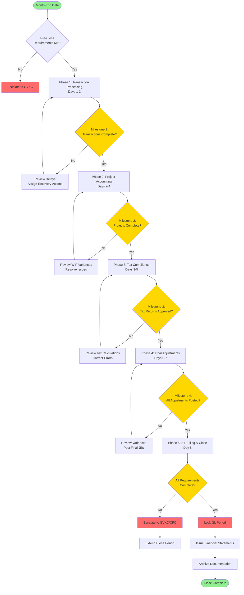
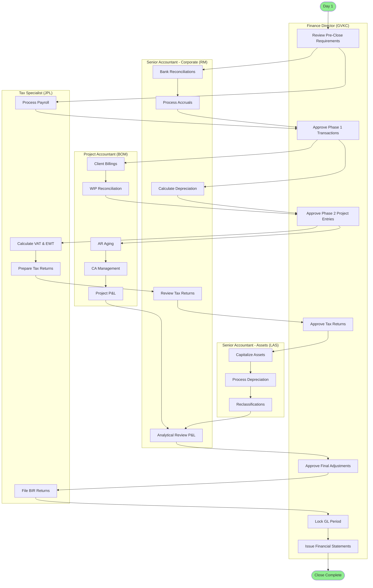
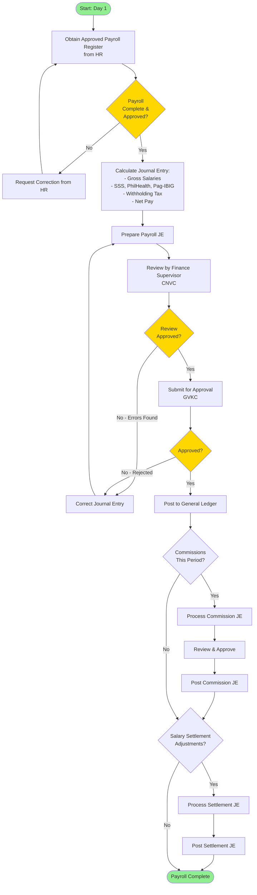
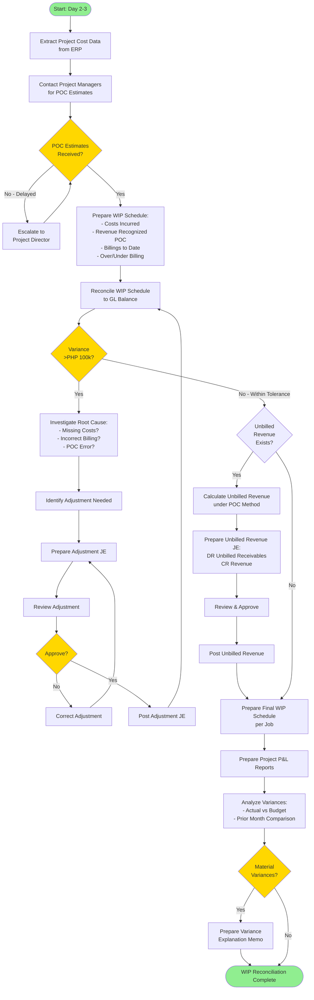
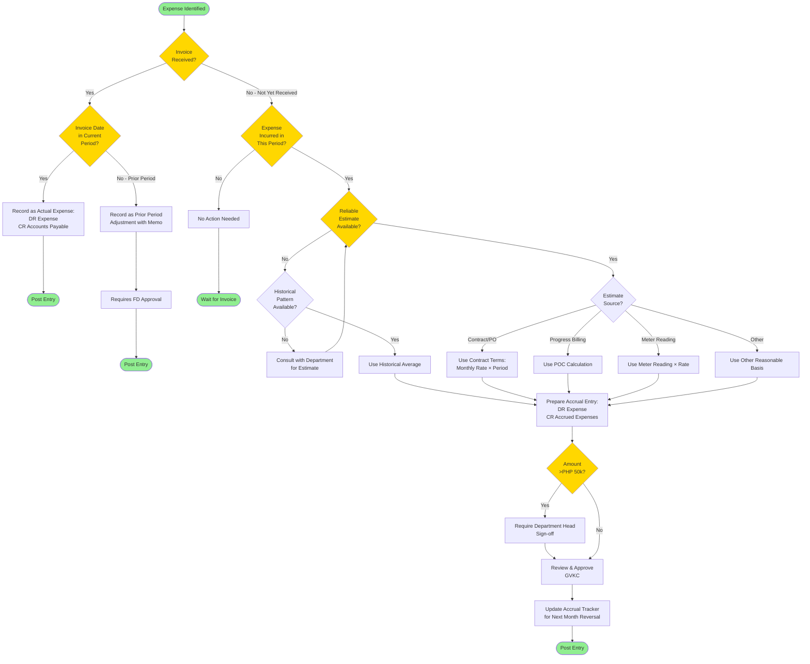
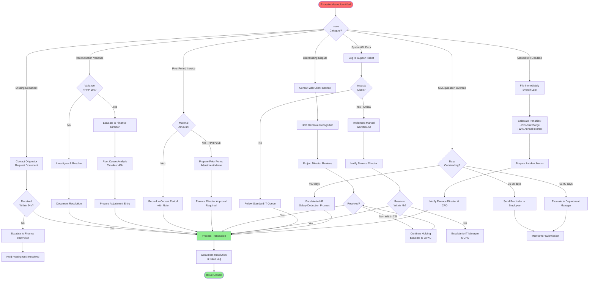
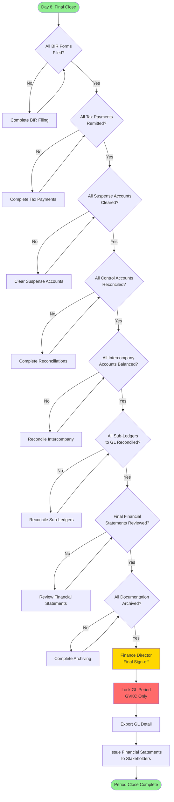
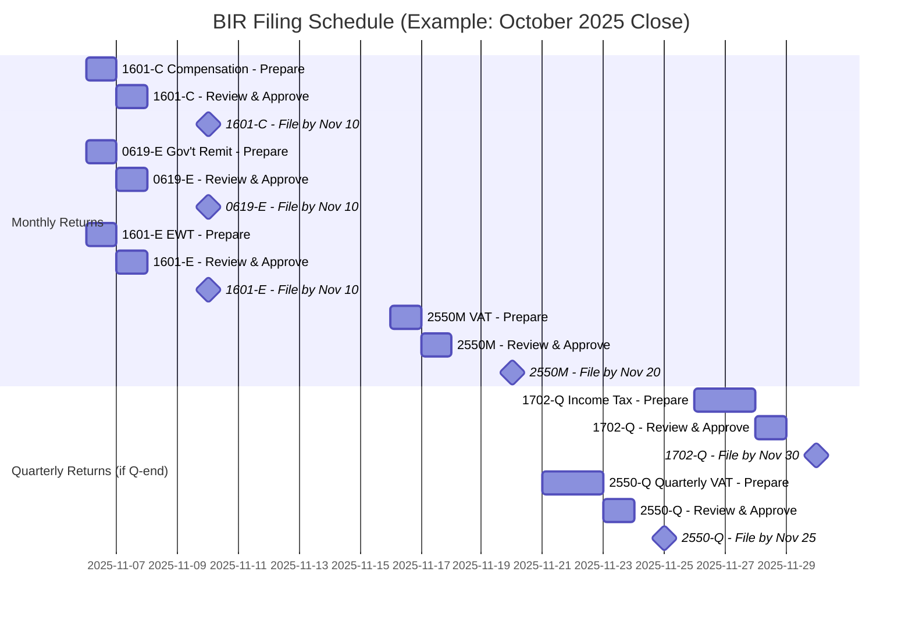

# Process Diagrams: Month-End Closing

**Document Control**
- **Document ID:** FIN-BPMN-001
- **Version:** 1.0
- **Effective Date:** 2025-11-15
- **Related Documents:** FIN-SOP-001, FIN-RACI-001, FIN-TIMELINE-001

---

## Overview

This document provides Business Process Model and Notation (BPMN) style diagrams for the month-end closing process. The diagrams use Mermaid syntax and can be rendered in most modern documentation platforms.

**Diagram Types:**
1. High-Level Close Process Flow
2. Swimlane Diagrams by Function
3. Detailed Sub-Process Flows
4. Decision Tree Diagrams
5. Tax Filing Workflow

---

## 1. High-Level Month-End Close Process



---

## 2. Swimlane Diagram - Overall Close Process



---

## 3. Detailed Sub-Process: Payroll Processing



---

## 4. Detailed Sub-Process: WIP/POP Reconciliation



---

## 5. Detailed Sub-Process: VAT Computation and Filing

```mermaid
flowchart TD
    Start([Start: Day 3]) --> CompileSales[Compile Sales Register<br/>Extract from GL]
    CompilePurchases[Compile Purchases Register<br/>Extract from GL]

    Start --> CompilePurchases

    CompileSales --> CalcOutput[Calculate Output VAT:<br/>Sales × 12%]
    CompilePurchases --> ReviewInput[Review Input VAT Claims:<br/>- Valid VAT Invoice?<br/>- Business Purpose?<br/>- TIN Verification]

    ReviewInput --> Disallow{Disallowances<br/>Identified?}
    Disallow -->|Yes| RemoveInvalid[Remove Invalid Claims:<br/>- Non-VAT Purchases<br/>- Missing Invoices<br/>- Personal Expenses]
    RemoveInvalid --> CalcInput
    Disallow -->|No| CalcInput[Calculate Input VAT:<br/>Valid Purchases × 12%]

    CalcOutput --> Reconcile[Reconcile VAT Accounts to GL]
    CalcInput --> Reconcile

    Reconcile --> GLMatch{GL<br/>Reconciled?}
    GLMatch -->|No| InvestigateGL[Investigate Differences]
    InvestigateGL --> AdjustGL[Post Reconciliation Adjustments]
    AdjustGL --> Reconcile

    GLMatch -->|Yes| CalcNet[Calculate Net VAT:<br/>Output VAT - Input VAT - Withholding VAT]

    CalcNet --> NetResult{Net<br/>Result?}
    NetResult -->|Payable| RecordPayable[DR Output VAT<br/>CR Input VAT<br/>CR WHT VAT<br/>CR VAT Payable]
    NetResult -->|Excess Input| RecordExcess[DR Output VAT<br/>DR VAT Excess Input<br/>CR Input VAT<br/>CR WHT VAT]

    RecordPayable --> PrepareBIR
    RecordExcess --> PrepareBIR[Prepare BIR Form 2550M]

    PrepareBIR --> ReviewRM[Review by Senior Accountant<br/>RM]
    ReviewRM --> ReviewResult{Review<br/>Passed?}
    ReviewResult -->|No| CorrectReturn[Correct Errors]
    CorrectReturn --> PrepareBIR

    ReviewResult -->|Yes| ApproveGVKC[Approve by Finance Director<br/>GVKC]
    ApproveGVKC --> ApprovalResult{Approved?}
    ApprovalResult -->|No| CorrectReturn

    ApprovalResult -->|Yes| PreparePayment{Net VAT<br/>Payable?}
    PreparePayment -->|Yes| CreateVoucher[Prepare Payment Voucher]
    CreateVoucher --> ApprovePayment[Approve Payment<br/>GVKC]
    ApprovePayment --> FileReturn
    PreparePayment -->|No - Excess| FileReturn[File via BIR eFPS<br/>Deadline: 20th of following month]

    FileReturn --> RemitPayment{Payment<br/>Required?}
    RemitPayment -->|Yes| PayBank[Remit Payment via<br/>Authorized Agent Bank]
    PayBank --> ObtainConfirm
    RemitPayment -->|No| ObtainConfirm[Obtain Filing Confirmation]

    ObtainConfirm --> ArchiveDoc[Archive BIR Form & Confirmation]
    ArchiveDoc --> Complete([VAT Filing Complete])

    style Start fill:#90EE90
    style Complete fill:#90EE90
    style Disallow fill:#FFD700
    style GLMatch fill:#FFD700
    style NetResult fill:#FFD700
    style ReviewResult fill:#FFD700
    style ApprovalResult fill:#FFD700
```



---

## 6. Tax Filing Workflow (Generic)

```mermaid
flowchart LR
    subgraph "Step 1: Preparation BIR Deadline - 4 Days"
        A1[Gather Source Data] --> A2[Prepare BIR Form]
        A2 --> A3[Complete Form]
        A3 --> A4[Draft Payment Request]
        A4 --> A5[Prepare Supporting Schedules]
    end

    subgraph "Step 2: Report Approval BIR Deadline - 2 Days"
        B1[Submit to Senior Finance Manager] --> B2[SFM Reviews Form]
        B2 --> B3{Approved?}
        B3 -->|No| B4[Return for Correction]
        B4 --> A2
        B3 -->|Yes| B5[Submit File Request to FD]
    end

    subgraph "Step 3: Payment Approval BIR Deadline - 1 Day"
        C1[Finance Director Reviews] --> C2{Payment<br/>Approved?}
        C2 -->|No| C3[Return for Review]
        C3 --> B1
        C2 -->|Yes| C4[Approve Payment Release]
    end

    subgraph "Step 4: Filing & Payment BIR Deadline"
        D1[File Return via eFPS] --> D2[Generate Reference Number]
        D2 --> D3[Remit Payment to Bank]
        D3 --> D4[Obtain Payment Confirmation]
        D4 --> D5[Archive Documents]
    end

    A5 --> B1
    B5 --> C1
    C4 --> D1

    style A1 fill:#E8F4F8
    style B1 fill:#FFF4E6
    style C1 fill:#FFF0F5
    style D1 fill:#F0FFF0
    style B3 fill:#FFD700
    style C2 fill:#FFD700
```



---

## 7. Decision Tree: Accrual vs. Actual Expense



---

## 8. Exception Handling Process



---

## 9. Period Close Final Checklist Flow



---

## 10. Monthly BIR Filing Calendar Flow



---

## How to Use These Diagrams

### Rendering in Documentation Platforms

**Supported Platforms:**
- **GitHub/GitLab**: Mermaid is natively supported in markdown files
- **Notion**: Use Mermaid embed or third-party integrations
- **Confluence**: Install Mermaid plugin
- **Docusaurus**: Native Mermaid support with `@docusaurus/theme-mermaid`
- **VS Code**: Install Mermaid preview extension

### Exporting Diagrams

**To PNG/SVG:**
```bash
# Using mermaid-cli (mmdc)
npm install -g @mermaid-js/mermaid-cli
mmdc -i BPMN.md -o diagrams/
```

**To PowerPoint/Visio:**
1. Render diagram in browser
2. Copy to clipboard
3. Paste into PowerPoint/Visio as image
4. Or use online converters like mermaid.live

### Customizing Diagrams

**Change Colors:**


**Available Themes:**
- `default` (light)
- `dark`
- `forest` (green)
- `neutral` (gray)

---

## Process Improvement Recommendations

Based on the process diagrams, the following improvements are recommended:

### Bottleneck Identification

1. **WIP Reconciliation (Day 3):**
   - **Issue:** Dependent on Project Manager POC estimates
   - **Recommendation:** Implement automated POC calculation tool; establish hard deadline for PM input

2. **VAT Compilation (Day 3-4):**
   - **Issue:** Manual validation of input VAT invoices
   - **Recommendation:** Implement pre-validation at invoice approval stage; automate TIN verification

3. **Final Approval (Day 7):**
   - **Issue:** Single point of approval (GVKC)
   - **Recommendation:** Implement dual approval system for non-critical items; escalation protocol if GVKC unavailable

### Automation Opportunities

1. **Bank Reconciliation:** Implement automated bank feed integration
2. **Depreciation Calculation:** Automate from fixed asset register
3. **VAT Reconciliation:** Auto-reconcile Output/Input VAT to GL
4. **Accrual Tracking:** Implement automated reversal in following month
5. **BIR Filing:** Use API integration for eFPS (if available)

### Control Enhancements

1. **Add Pre-Close Validation:** System check before Day 1 starts
2. **Real-Time Dashboard:** Live status tracking of close progress
3. **Automated Alerts:** Email notifications for approaching deadlines
4. **Audit Trail:** Enhanced logging of all approvals and changes

---

## Revision History

| Version | Date | Author | Changes |
|---------|------|--------|---------|
| 1.0 | 2025-11-15 | Finance Team | Initial BPMN documentation with Mermaid diagrams |

---

**END OF DOCUMENT**
