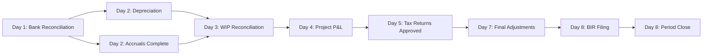

# Month-End Closing Timeline and Workflow

**Document Control**
- **Document ID:** FIN-TIMELINE-001
- **Version:** 1.0
- **Effective Date:** 2025-11-15
- **Related Documents:** FIN-SOP-001, FIN-RACI-001

---

## Overview

This document provides a detailed timeline for the month-end closing process, showing:
- **Task sequencing** and dependencies
- **Parallel vs. sequential workflows**
- **Critical path** items that cannot be delayed
- **Resource allocation** by day and role
- **Lead time** requirements before final close

**Standard Close Period:** 8 business days (Last day of month + 7 business days)

**Example Timeline:** October 2025 close
- **Month-End Date:** October 31, 2025
- **Close Period:** October 27 - November 4, 2025
- **Target Close Date:** November 4, 2025 (Day 8)

---

## Timeline Summary - Critical Milestones

| Milestone | Target Date | Critical Deliverables | Gate Keeper |
|-----------|-------------|----------------------|-------------|
| **M1: Transaction Processing Complete** | Day 3 (Oct 29) | All routine transactions posted; payroll complete; bank recs done | GVKC |
| **M2: Project Accounting Complete** | Day 4 (Oct 30) | WIP reconciled; client billings posted; AR aged | GVKC |
| **M3: Tax Compliance Ready** | Day 5 (Oct 31) | VAT/EWT computed; tax provision recorded | GVKC |
| **M4: Final Adjustments Complete** | Day 7 (Nov 3) | All reclassifications done; P&L reviewed and approved | GVKC |
| **M5: BIR Filing & Period Close** | Day 8 (Nov 4) | All BIR forms filed; GL period locked | GVKC |

---

## Gantt Chart - Month-End Closing

```
DAY 1 (Oct 27)         DAY 2 (Oct 28)         DAY 3 (Oct 29)         DAY 4 (Oct 30)         DAY 5 (Oct 31)
─────────────────────  ─────────────────────  ─────────────────────  ─────────────────────  ─────────────────────
┌─ Payroll (JPL)────┐
│ Process & Post    │
└───────────────────┘

┌─ Rent (CNVC)──────┐
│ Accrue & Post     │
└───────────────────┘

┌─ Accruals (RM)────────────────────────┐
│ Identify, Calculate, Review, Post     │
└────────────────────────────────────────┘

┌─ Bank Recs (RM)───┐
│ Reconcile All     │
└───────────────────┘

                     ┌─ Depr/Amort (RM/LAS)──────────┐
                     │ Calculate & Post               │
                     └────────────────────────────────┘

                     ┌─ Corporate Recs (RM)──────────┐
                     │ Loans, IC, Deposits            │
                     └────────────────────────────────┘

                                          ┌─ Client Billings (BOM)─────────────┐
                                          │ Prepare invoices, post revenue      │
                                          └─────────────────────────────────────┘

                                          ┌─ WIP/POP Recon (BOM)──────────────────────────┐
                                          │ Reconcile projects, adjust accruals            │
                                          └────────────────────────────────────────────────┘

                                          ┌─ AR Aging (BOM)──────────────┐
                                          │ Prepare aging, follow up      │
                                          └───────────────────────────────┘

                                          ┌─ CA Liquidation (BOM)────────┐
                                          │ Process employee expenses     │
                                          └───────────────────────────────┘

                                                                   ┌─ VAT (JPL)────────────┐
                                                                   │ Compile & file draft   │
                                                                   └────────────────────────┘

                                                                   ┌─ EWT (JPL)────────────┐
                                                                   │ Compute & prepare      │
                                                                   └────────────────────────┘

                                                                                            ┌─ Assets (LAS)─────┐
                                                                                            │ Capitalize & depr  │
                                                                                            └────────────────────┘


DAY 6 (Nov 1)          DAY 7 (Nov 3)          DAY 8 (Nov 4)
─────────────────────  ─────────────────────  ─────────────────────

┌─ Reclassifications (LAS)───────────┐
│ Process all reclass entries         │
└─────────────────────────────────────┘

┌─ P&L Review (RM/BOM)────────────────────────┐
│ Analytical review, variance analysis         │
└──────────────────────────────────────────────┘

                     ┌─ WC Finalization (BOM)─────────┐
                     │ Final AR/CA/WIP schedules       │
                     └─────────────────────────────────┘

                     ┌─ Final Approval (GVKC)─────────┐
                     │ Review all entries & reports    │
                     └─────────────────────────────────┘

                                          ┌─ BIR Filing (JPL/LAS)──┐
                                          │ File all monthly returns│
                                          └─────────────────────────┘

                                          ┌─ Period Close (GVKC)───┐
                                          │ Lock GL, issue reports  │
                                          └─────────────────────────┘
```

---

## Detailed Daily Timeline

### **DAY 1 (October 27, 2025) - Monday**

**Focus:** Payroll, Treasury, Core Accruals

| Time | Task | Owner | Dependencies | Output |
|------|------|-------|--------------|--------|
| **9:00 AM** | Receive approved payroll register from HR | JPL | HR payroll approval | Payroll register |
| **9:30 AM** | Review active lease agreements | CNVC | Contract register | Lease schedule |
| **9:30 AM** | Start bank reconciliations (all accounts) | RM | Bank statements | - |
| **10:00 AM** | Process payroll journal entry | JPL | Payroll register | Payroll JE |
| **10:30 AM** | Calculate rental accruals | CNVC | Lease schedule | Rental accrual JE |
| **11:00 AM** | Identify monthly accrual requirements | JPL, RM | Department inputs | Accrual list |
| **12:00 PM** | **LUNCH BREAK** | - | - | - |
| **1:00 PM** | Review payroll JE | CNVC | Payroll JE | - |
| **1:30 PM** | Approve payroll JE | GVKC | CNVC review | Approved JE |
| **2:00 PM** | Post payroll to GL | JPL | GVKC approval | GL updated |
| **2:00 PM** | Review and approve rental accrual | GVKC | Rental accrual JE | Approved JE |
| **2:30 PM** | Calculate operating expense accruals | RM, JPL | POs, contracts | Accrual worksheets |
| **3:00 PM** | Review prior period temporary entries | GVKC | Prior month GL | Reversal list |
| **4:00 PM** | Reconcile corporate balance sheet accounts | RM | Loan statements, IC confirmations | Reconciliation worksheets |
| **5:00 PM** | Calculate insurance accruals | RM | Insurance policy register | Insurance JE |
| **5:30 PM** | **DAY 1 STATUS CHECK** | GVKC | All Day 1 tasks | Status email |

**Day 1 Deliverables:**
- ✅ Payroll posted
- ✅ Rent accrued
- ✅ Bank reconciliations in progress
- ✅ Accrual list identified

---

### **DAY 2 (October 28, 2025) - Tuesday**

**Focus:** Accruals, Depreciation, Project Setup

| Time | Task | Owner | Dependencies | Output |
|------|------|-------|--------------|--------|
| **9:00 AM** | Complete bank reconciliations | RM | Bank statements | Completed bank recs |
| **9:00 AM** | Update fixed asset register | RM, LAS | Asset acquisition docs | Updated FAR |
| **9:30 AM** | Extract project cost data | BOM | ERP system | Project cost reports |
| **10:00 AM** | Calculate monthly depreciation | RM, LAS | Fixed asset register | Depreciation schedule |
| **10:30 AM** | Finalize operating expense accruals | RM, JPL | Department approvals | Accrual JEs |
| **11:00 AM** | Perform forex revaluation | RM | BSP exchange rates | Forex gain/loss JE |
| **12:00 PM** | **LUNCH BREAK** | - | - | - |
| **1:00 PM** | Post depreciation/amortization JE | LAS | GVKC approval | GL updated |
| **1:30 PM** | Review and post accrual JEs | JPL, RM | GVKC approval | GL updated |
| **2:00 PM** | Confirm POC estimates with Project Managers | BOM | PM feedback | POC confirmations |
| **2:30 PM** | Record interest income and bank charges | RM | Bank statements | Treasury JEs |
| **3:00 PM** | Prepare preliminary WIP schedule | BOM | Project cost data | WIP draft |
| **4:00 PM** | Review insurance accruals | GVKC | Insurance schedule | - |
| **5:00 PM** | **DAY 2 STATUS CHECK** | GVKC | All Day 2 tasks | Status email |

**Day 2 Deliverables:**
- ✅ Bank reconciliations complete
- ✅ Depreciation/amortization posted
- ✅ Accruals posted
- ✅ WIP schedule draft prepared

---

### **DAY 3 (October 29, 2025) - Wednesday**

**Focus:** Project Accounting, VAT/Tax Setup, CA Processing

| Time | Task | Owner | Dependencies | Output |
|------|------|-------|--------------|--------|
| **9:00 AM** | Obtain approved billing requests | BOM | Project Management | Billing request forms |
| **9:00 AM** | Compile VAT sales and purchases registers | JPL | GL data | VAT registers |
| **9:30 AM** | Process CA liquidations - project expenses | BOM | Employee expense reports | CA liquidation JEs |
| **10:00 AM** | Prepare client invoices | BOM | Billing requests | Client invoices |
| **10:30 AM** | Reconcile WIP to GL | BOM | WIP schedule, GL | WIP variance analysis |
| **11:00 AM** | Reconcile VAT accounts to GL | JPL | VAT registers, GL | VAT reconciliation |
| **12:00 PM** | **LUNCH BREAK** | - | - | - |
| **1:00 PM** | Post client billing JEs | BOM | GVKC approval | GL updated |
| **1:30 PM** | Accrue unbilled revenue (POC) | BOM | POC calculations | Unbilled revenue JE |
| **2:00 PM** | Review input VAT validity | JPL | Supplier invoices | Input VAT schedule |
| **2:30 PM** | Prepare AR aging report | BOM | AR sub-ledger | AR aging |
| **3:00 PM** | Prepare CA aging report | BOM | CA sub-ledger | CA aging |
| **3:30 PM** | Record WIP adjustments | BOM | WIP variance analysis | WIP adjustment JEs |
| **4:00 PM** | Prepare BIR Form 2550M (VAT) - draft | JPL | VAT reconciliation | VAT return draft |
| **5:00 PM** | **DAY 3 STATUS CHECK** | GVKC | All Day 3 tasks | Status email |
| **EOD** | **MILESTONE 1: Transaction Processing Complete** | GVKC | All Phase 1 tasks | Go/No-Go decision |

**Day 3 Deliverables:**
- ✅ Client billings posted
- ✅ WIP reconciled to GL
- ✅ AR aging prepared
- ✅ VAT return drafted

---

### **DAY 4 (October 30, 2025) - Thursday**

**Focus:** Tax Finalization, Project P&L, Prior Period Adjustments

| Time | Task | Owner | Dependencies | Output |
|------|------|-------|--------------|--------|
| **9:00 AM** | Review VAT return | RM | VAT draft | - |
| **9:00 AM** | Prepare project P&L reports | BOM | Project data | Project P&Ls |
| **9:30 AM** | Compile EWT transactions | JPL | Payment vouchers | EWT schedule |
| **10:00 AM** | Process prior period reversals | RM | Reversal list | Reversal JEs |
| **10:30 AM** | Approve VAT return | GVKC | RM review | Approved VAT return |
| **11:00 AM** | Prepare BIR Form 1601-E (EWT) | JPL | EWT schedule | EWT return |
| **12:00 PM** | **LUNCH BREAK** | - | - | - |
| **1:00 PM** | Analyze project variances (actual vs budget) | BOM | Project P&Ls | Variance analysis |
| **1:30 PM** | Calculate income tax provision | RM | YTD pre-tax income | Tax provision JE |
| **2:00 PM** | Coordinate with Client Service on collections | BOM | AR aging | Collection status |
| **2:30 PM** | Process CA liquidations - employee advances | BOM | Employee reports | CA liquidation JEs |
| **3:00 PM** | Post tax provision JE | RM | GVKC approval | GL updated |
| **3:30 PM** | Post prior period adjustment JEs | RM | GVKC approval | GL updated |
| **4:00 PM** | Finalize WIP summary per job | BOM | WIP reconciliation | WIP final schedule |
| **5:00 PM** | **DAY 4 STATUS CHECK** | GVKC | All Day 4 tasks | Status email |
| **EOD** | **MILESTONE 2: Project Accounting Complete** | GVKC | All Phase 2 tasks | Go/No-Go decision |

**Day 4 Deliverables:**
- ✅ VAT return approved
- ✅ EWT return prepared
- ✅ Project P&Ls completed
- ✅ Tax provision recorded

---

### **DAY 5 (October 31, 2025) - Friday [MONTH-END]**

**Focus:** Asset Capitalizations, Tax Compliance Finalization

| Time | Task | Owner | Dependencies | Output |
|------|------|-------|--------------|--------|
| **9:00 AM** | Review capex transactions for capitalization | LAS | Purchase invoices | Capex list |
| **9:00 AM** | Review EWT return | RM | EWT draft | - |
| **9:30 AM** | Identify and process new asset additions | LAS | Capex list | Asset addition JEs |
| **10:00 AM** | Approve EWT return | GVKC | RM review | Approved EWT return |
| **10:30 AM** | Record right-of-use assets (new leases) | LAS | Lease agreements | ROU asset JEs |
| **11:00 AM** | Update fixed asset register | LAS | Asset additions | Updated FAR |
| **12:00 PM** | **LUNCH BREAK** | - | - | - |
| **1:00 PM** | Calculate depreciation on new assets | LAS | Updated FAR | Updated depr schedule |
| **1:30 PM** | Post asset and depreciation JEs | LAS | GVKC approval | GL updated |
| **2:00 PM** | Prepare VAT payment voucher | JPL | Approved VAT return | Payment voucher |
| **2:30 PM** | Prepare EWT payment voucher | JPL | Approved EWT return | Payment voucher |
| **3:00 PM** | Approve tax payment vouchers | GVKC | JPL preparation | Approved vouchers |
| **4:00 PM** | Generate preliminary financial statements | RM | All postings complete | Preliminary FS |
| **5:00 PM** | **DAY 5 STATUS CHECK** | GVKC | All Day 5 tasks | Status email |
| **EOD** | **MILESTONE 3: Tax Compliance Ready** | GVKC | All Phase 3 tasks | Go/No-Go decision |

**Day 5 Deliverables:**
- ✅ Asset capitalizations posted
- ✅ All tax returns approved
- ✅ Payment vouchers prepared
- ✅ Preliminary financial statements generated

---

### **DAY 6 (November 1, 2025) - Saturday [WEEKEND - Optional Work]**

**Focus:** Analytical Review, Reclassifications

*Note: Typically a non-working day; critical path items only if needed*

| Time | Task | Owner | Dependencies | Output |
|------|------|-------|--------------|--------|
| **As Needed** | Review preliminary P&L | GVKC, RM, BOM | Preliminary FS | Variance list |
| **As Needed** | Identify reclassification needs | LAS | GL review | Reclass list |
| **As Needed** | Catch-up on delayed tasks | Various | - | - |

---

### **DAY 7 (November 3, 2025) - Monday**

**Focus:** Final Adjustments, Reclassifications, Working Capital Finalization

| Time | Task | Owner | Dependencies | Output |
|------|------|-------|--------------|--------|
| **9:00 AM** | Process GL reclassifications | LAS | Reclass list | Reclass JEs |
| **9:00 AM** | Perform final P&L analytical review | RM, BOM | Preliminary P&L | Variance analysis |
| **9:30 AM** | Process internal charge-backs | RM | Allocation schedules | Chargeback JEs |
| **10:00 AM** | Investigate material variances | RM, BOM | Variance analysis | Variance explanations |
| **10:30 AM** | Finalize AR aging with collection status | BOM | Client Service input | Final AR aging |
| **11:00 AM** | Finalize CA aging with follow-up actions | BOM | Department inputs | Final CA aging |
| **12:00 PM** | **LUNCH BREAK** | - | - | - |
| **1:00 PM** | Post reclassification JEs | LAS | GVKC approval | GL updated |
| **1:30 PM** | Post final adjustment JEs | RM | GVKC approval | GL updated |
| **2:00 PM** | Prepare HO/TV summary report | LAS | All GL postings | HO/TV report |
| **2:30 PM** | Finalize all working capital schedules | BOM | Final AR/CA/WIP | WC package |
| **3:00 PM** | Calculate working capital KPIs | BOM | WC schedules | KPI dashboard |
| **3:30 PM** | Generate final financial statements | RM | All postings complete | Final FS (draft) |
| **4:00 PM** | Review final financial statements | GVKC | Final FS | Review notes |
| **4:30 PM** | Prepare variance explanation memo | RM, BOM | Variance analysis | Memo |
| **5:00 PM** | **DAY 7 STATUS CHECK** | GVKC | All Day 7 tasks | Status email |
| **EOD** | **MILESTONE 4: Final Adjustments Complete** | GVKC | All Phase 4 tasks | Go/No-Go decision |

**Day 7 Deliverables:**
- ✅ All reclassifications posted
- ✅ Final financial statements prepared
- ✅ All working capital schedules finalized
- ✅ Variance explanations documented

---

### **DAY 8 (November 4, 2025) - Tuesday**

**Focus:** BIR Filing, Period Close, Reporting

| Time | Task | Owner | Dependencies | Output |
|------|------|-------|--------------|--------|
| **9:00 AM** | Compile all tax submission documents | JPL, LAS | Approved returns | Tax filing package |
| **9:30 AM** | File BIR Form 1601-C (if applicable) | JPL | Tax package | Filed return |
| **9:45 AM** | File BIR Form 0619-E | JPL | Tax package | Filed return |
| **10:00 AM** | File BIR Form 1601-E (EWT) | JPL | Tax package | Filed return |
| **10:15 AM** | File BIR Form 2550M (VAT) | JPL | Tax package | Filed return |
| **10:30 AM** | Remit tax payments via bank | JPL | Payment vouchers | Payment confirmations |
| **11:00 AM** | Obtain and file payment confirmations | JPL | Bank receipts | Filed confirmations |
| **12:00 PM** | **LUNCH BREAK** | - | - | - |
| **1:00 PM** | Perform final GL review | GVKC | All postings | - |
| **1:30 PM** | Clear all suspense accounts | RM | GL review | Clearing JEs |
| **2:00 PM** | Verify all control account reconciliations | GVKC | Reconciliation package | Sign-off |
| **2:30 PM** | Generate final trial balance | RM | GL | Trial balance |
| **3:00 PM** | Export GL detail for archive | RM | GL | GL export file |
| **3:30 PM** | **LOCK ACCOUNTING PERIOD** | GVKC | Final approval | Period locked |
| **4:00 PM** | Issue final financial statements to stakeholders | GVKC | Locked period | Distributed FS |
| **4:30 PM** | Archive all supporting documentation | Various | Document checklist | Archived files |
| **5:00 PM** | **CLOSE COMPLETE** | GVKC | All tasks | Close sign-off |
| **EOD** | **MILESTONE 5: Period Closed** | GVKC | All Phase 5 tasks | Close complete |

**Day 8 Deliverables:**
- ✅ All BIR forms filed
- ✅ All tax payments remitted
- ✅ GL period locked
- ✅ Final financial statements issued

---

## Critical Path Analysis

### Tasks on Critical Path (Cannot Be Delayed)



**Critical Path Tasks:**
1. **Bank Reconciliation** (Day 1) → Impacts cash position
2. **Depreciation** (Day 2) → Impacts asset values and P&L
3. **Accruals** (Day 1-2) → Impacts expense recognition
4. **WIP Reconciliation** (Day 3) → Impacts revenue recognition
5. **Project P&L** (Day 4) → Required for management review
6. **Tax Returns** (Day 5) → Statutory deadline dependencies
7. **Final Adjustments** (Day 7) → Required before lock
8. **BIR Filing** (Day 8) → External compliance requirement
9. **Period Close** (Day 8) → Final gate

**Float (Flexible) Tasks:**
- Insurance accruals (can move to Day 2-3)
- CA aging reports (can finalize Day 6-7)
- Reclassifications (can process Day 6-7)
- Asset capitalizations (can move to Day 4-5 if no major additions)

---

## Parallel vs. Sequential Workflows

### Parallel Workflows (Can Run Simultaneously)

**Day 1 Parallel Tracks:**
```
┌─ Track 1: Payroll (JPL) ────────────────┐
│                                          │
├─ Track 2: Rent (CNVC) ──────────────────┤
│                                          │
├─ Track 3: Bank Recs (RM) ───────────────┤
│                                          │
└─ Track 4: Accruals (RM, JPL) ───────────┘
```

**Day 3 Parallel Tracks:**
```
┌─ Track 1: Client Billing (BOM) ─────────┐
│                                          │
├─ Track 2: VAT Computation (JPL) ────────┤
│                                          │
└─ Track 3: CA Liquidation (BOM) ─────────┘
```

### Sequential Dependencies

**Must Complete in Order:**
```
1. Payroll Register (HR)
   ↓
2. Payroll JE (JPL)
   ↓
3. Payroll Review (CNVC)
   ↓
4. Payroll Approval (GVKC)
   ↓
5. Post to GL (JPL)
```

```
1. Project Cost Data (BOM)
   ↓
2. POC Confirmation (PM)
   ↓
3. WIP Schedule (BOM)
   ↓
4. WIP Reconciliation (BOM)
   ↓
5. WIP Adjustments (BOM)
   ↓
6. Approval (GVKC)
```

---

## Resource Loading by Day

| Day | JPL | CNVC | RM | BOM | LAS | GVKC | Peak Load |
|-----|-----|------|----|----|-----|------|-----------|
| **Day 1** | ███████ (7h) | ████ (4h) | ████████ (8h) | ██ (2h) | █ (1h) | ████ (4h) | RM (8h) |
| **Day 2** | ████ (4h) | ██ (2h) | ████████ (8h) | █████ (5h) | ██████ (6h) | ███ (3h) | RM (8h) |
| **Day 3** | ███████ (7h) | ██ (2h) | ████ (4h) | ████████ (8h) | ██ (2h) | ████ (4h) | BOM (8h) |
| **Day 4** | ██████ (6h) | ██ (2h) | ███████ (7h) | ████████ (8h) | ███ (3h) | █████ (5h) | BOM (8h) |
| **Day 5** | █████ (5h) | ██ (2h) | █████ (5h) | ███ (3h) | ████████ (8h) | █████ (5h) | LAS (8h) |
| **Day 6** | - | - | ███ (3h) | ███ (3h) | ███ (3h) | ████ (4h) | (Flex) |
| **Day 7** | ██ (2h) | ██ (2h) | ███████ (7h) | ███████ (7h) | ████████ (8h) | ██████ (6h) | LAS (8h) |
| **Day 8** | ████████ (8h) | ██ (2h) | █████ (5h) | ██ (2h) | █████ (5h) | ████████ (8h) | JPL, GVKC (8h) |

**Peak Capacity Days:**
- **Day 3:** BOM at full capacity (project accounting)
- **Day 4:** BOM at full capacity (P&L and variances)
- **Day 5:** LAS at full capacity (asset management)
- **Day 7:** LAS at full capacity (reclassifications)
- **Day 8:** JPL and GVKC at full capacity (filing and close)

---

## Lead Time Requirements

### Before Closing Period Starts (Pre-Close Activities)

| Activity | Lead Time | Responsible | Deliverable |
|----------|-----------|-------------|-------------|
| HR payroll approval | Month-end - 2 days | HR | Approved payroll register |
| Bank statement receipt | Month-end - 1 day | Treasury/CNVC | All bank statements |
| Project Manager POC estimates | Month-end - 1 day | PM | POC confirmations |
| Supplier invoice submission cutoff | Month-end | Procurement | All invoices received |
| Employee CA liquidation reminder | Month-end - 3 days | BOM | CA liquidations submitted |
| Department accrual requests | Month-end - 2 days | All Departments | Accrual requirements |

### After Close (Post-Close Activities)

| Activity | Timeline | Responsible | Deliverable |
|----------|----------|-------------|-------------|
| Distribute financial statements | Close + 1 day | GVKC | FS to stakeholders |
| Management review meeting | Close + 2 days | CFO | Management presentation |
| Board reporting (if required) | Close + 5 days | CFO | Board pack |
| File supporting documents | Close + 3 days | All | Archived documentation |
| Post-close review / lessons learned | Close + 7 days | GVKC | Process improvements |

---

## Timeline Variance Management

### If Ahead of Schedule

| Scenario | Action |
|----------|--------|
| **Day 2 tasks complete on Day 1** | Proceed with Day 3 tasks early; use extra time for quality review |
| **Project accounting complete early** | Use buffer time for deeper variance analysis and collection follow-up |
| **All tasks complete by Day 6** | Perform additional analytical review; prepare early reporting to management |

### If Behind Schedule

| Delay | Impact | Mitigation Action | Escalation |
|-------|--------|-------------------|------------|
| **Payroll delayed (Day 1)** | CRITICAL - Impacts remittance deadlines | Work overtime on Day 1; escalate to HR immediately | GVKC → CFO |
| **Bank rec delayed (Day 2)** | HIGH - Impacts cash position accuracy | Prioritize main operating accounts; defer minor accounts to Day 3 | GVKC |
| **WIP recon delayed (Day 3)** | HIGH - Impacts revenue recognition | Escalate to Project Managers; extend Day 3 deadline to Day 4 AM | GVKC → PM |
| **VAT computation delayed (Day 4)** | CRITICAL - Impacts BIR filing deadline | Work overtime; prepare draft for early review | GVKC → CFO |
| **Final adjustments delayed (Day 7)** | HIGH - May delay close | Extend close to Day 9; notify stakeholders of delay | GVKC → CFO |

### Recovery Actions

**If More Than 1 Day Behind:**
1. Convene emergency close meeting (GVKC + all staff)
2. Re-prioritize tasks (critical path only)
3. Allocate additional resources / reassign tasks
4. Authorize overtime work
5. Defer non-critical items to post-close adjustments
6. Communicate revised timeline to stakeholders

---

## Monthly Close Calendar Template

Use this template to plan each month's close:

```
MONTH: ___________     YEAR: _____

Month-End Date: __________
Close Period: __________ to __________
Target Close Date: __________

CRITICAL DATES:
- Payroll approval deadline: __________
- Bank statement receipt: __________
- Project POC confirmation: __________
- Supplier invoice cutoff: __________
- BIR filing deadline (VAT): __________
- BIR filing deadline (EWT): __________

PRE-CLOSE CHECKLIST:
□ HR payroll register received
□ All bank statements received
□ Project Manager confirmations obtained
□ Department accrual requests submitted
□ Outstanding CA liquidations submitted
□ Prior month close locked and archived

DAILY STATUS:
Day 1: □ On Track  □ Delayed  □ Complete
Day 2: □ On Track  □ Delayed  □ Complete
Day 3: □ On Track  □ Delayed  □ Complete
Day 4: □ On Track  □ Delayed  □ Complete
Day 5: □ On Track  □ Delayed  □ Complete
Day 6: □ On Track  □ Delayed  □ Complete
Day 7: □ On Track  □ Delayed  □ Complete
Day 8: □ On Track  □ Delayed  □ Complete

CLOSE SIGN-OFF:
□ All BIR forms filed
□ All tax payments remitted
□ GL period locked
□ Financial statements issued
□ Documentation archived

Completed By: __________
Approved By: __________  Date: __________
```

---

## Revision History

| Version | Date | Author | Changes |
|---------|------|--------|---------|
| 1.0 | 2025-11-15 | Finance Team | Initial timeline documentation |

---

**END OF DOCUMENT**
